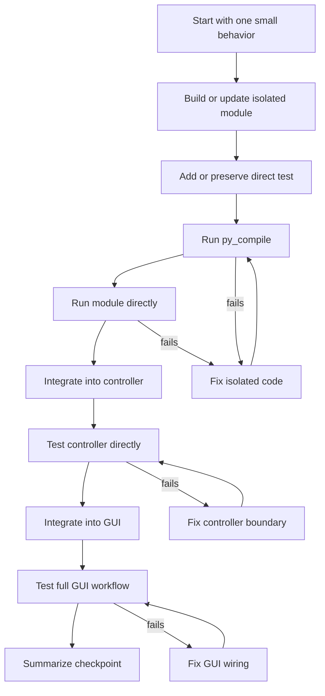

# Agent Memory

This file is durable project memory for future agents and developers working on
the T-Cubed Jetson codebase. Keep it practical and update it when a lesson,
constraint, or development rule should survive beyond one chat session.

## Project Snapshot

T-Cubed is a Jetson-based table-tennis training assistant.

The system is intended to:

- Record table-tennis training sessions.
- Analyze recordings with computer vision.
- Detect the table, ball, and bounces.
- Generate heatmaps and review outputs.
- Support a Tkinter GUI for training, analysis, and review workflows.

### Current integration checkpoint (2026-07-14)

- `main.py` launches the page-based GUI in `gui/gui.py`.
- Training has real low-FPS preview, GStreamer/MKV recording, outgoing STM32
  commands, and initial session-JSON creation wired through
  `TrainingController`.
- Analysis runs in a worker thread, supports versioned model folders, and writes
  annotated videos, heatmaps, and analysis data back to session JSON.
- Review lists session JSON files, displays saved summary metrics, and previews
  the session heatmap. It does not run analysis.
- `gui/GUI_Coulter.py`, `gui/gui_backup.py`, `gui/review_page_old.py`, the root
  `archived/` directory, and `analysis/archived/` are reference code, not the
  active application path.
- The current bounce implementation lives inside the active-ball tracker in
  `analysis/ball.py`. `analysis/bounce.py` adapts tracker results for outputs.

## Development Style

Make the smallest safe change that moves the project forward.



When possible, build new behavior in this order:

1. Build the isolated module or function.
2. Add or preserve a direct test.
3. Run `python3 -m py_compile path/to/file.py`.
4. Run the module directly.
5. Integrate into the controller.
6. Test the controller directly.
7. Integrate into the GUI.
8. Test the full GUI workflow.
9. Summarize the checkpoint before moving on.

Do not combine multiple major systems in one change.

Prefer:

- Clear names.
- Small functions.
- Explicit error handling.
- Useful terminal logs during hardware integration.
- Comments that explain why something is done.

Avoid:

- Big rewrites.
- Clever one-liners.
- Hidden side effects.
- Silent exception swallowing.
- Hardcoded absolute host paths.

## Architecture Boundaries

The project uses a layered, controller-based architecture:

```text
Tkinter GUI pages
    ->
Controller layer
    ->
Functional modules
    ->
Config / files / camera / STM32 / models
```

Layer responsibilities:

- `gui/` handles widgets, buttons, status text, logs, previews, and user interaction.
- `controller/` validates input, tracks state, coordinates modules, and sends messages back to GUI pages.
- `capture/` owns camera preview and recording.
- `comm/` owns STM32 protocol and serial I/O.
- `analysis/` owns computer-vision pipeline logic.
- Review consumes saved outputs and should not rerun analysis.

Important boundary rule:

```text
A GUI button should call one controller method.
The controller method may coordinate many lower-level modules.
```

## Common Rules

- Tkinter widgets must only be updated from the Tkinter main thread.
- Worker threads should put messages into queues; Tkinter pages should poll those queues with `after(...)`.
- Keep preview and recording separate.
- Stop preview before recording so `/dev/video0` is not used by two camera paths.
- GUI shows pace in seconds; STM32 receives pace in milliseconds.
- Do not switch recording back to 120 FPS unless explicitly requested; 60 FPS is the stable default.
- Do not rename folders, restructure packages, or add broad dependencies unless requested.
- Do not auto-run analysis after training unless explicitly requested later.
- Use the recording filename stem as the machine identity for its session JSON.
  Keep the human-friendly session name inside the JSON; display text must not
  change artifact lookup paths.
- Treat `ENABLE_REAL_RECORDING` and `ENABLE_REAL_STM32_SERIAL` as hardware safety
  switches. Both are currently `True`; do not run the full training direct test
  unless camera and launcher operation is intended.
- `USE_PLACEHOLDER_HARDWARE` is a legacy flag and is not the master hardware
  switch.
- Keep experiments and former implementations under `archived/`, and never fix
  a live bug only in an archived file.
- Preserve per-frame tracker state ordering unless a regression test proves the
  replacement behavior. Ball matching, bounce evaluation, challenger switching,
  and track reset affect one another.
- Four table corners are required for homography. Net-post keypoints are
  optional, but when present they provide a better launch-region boundary and
  should be stabilized across samples.

## Testing Commands

Run commands from the Jetson project root.

```bash
PYTHONPYCACHEPREFIX=/tmp/tcubed_pycache python3 -m py_compile path/to/file.py
PYTHONPYCACHEPREFIX=/tmp/tcubed_pycache python3 -m py_compile $(rg --files -g '*.py' -g '!archived/**' -g '!analysis/archived/**')
python3 analysis/tracker_parity_test.py
python3 main.py
python3 controller/training_controller.py
python3 controller/analysis_controller.py
python3 controller/review_controller.py
python3 capture/preview.py
python3 analysis/analysis.py
python3 comm/serial_direct_test.py --list
```

Use direct tests before GUI wiring when possible. This keeps hardware,
controller, and GUI problems easier to separate.

The temporary `PYTHONPYCACHEPREFIX` avoids failures when an existing
`__pycache__` directory is not writable. Compilation proves syntax/import-time
parsing only; camera, CUDA/YOLO, GStreamer, Tkinter display, and STM32 behavior
still require the Jetson runtime and connected hardware.

## Lessons Learned

Use this section for fixes, debugging discoveries, and things to avoid.

Template:

```md
### YYYY-MM-DD - Short Title

**Problem**
What broke or what was confusing.

**Cause**
Why it happened.

**Fix**
What solved it.

**Future Rule**
What agents/developers should do or avoid next time.

**Related Files**
- `path/to/file.py`
```

### 2026-06-10 - Do Not Import Project Serial As Plain `serial`

**Problem**
Python can confuse the project's `comm/serial.py` with the external `pyserial`
package.

**Cause**
Both can appear as `serial` in imports.

**Fix**
The Training Controller loads `comm/serial.py` carefully by path.

**Future Rule**
Do not replace this with a normal `import serial` unless the naming conflict is
resolved.

**Related Files**
- `controller/training_controller.py`
- `comm/serial.py`

### 2026-07-14 - Separate Display Names From Artifact Identity

**Problem**
A custom Training session name can create `custom_name_session.json`, while
Analysis searches only for `<recording_stem>_session.json`. Analysis then runs
but cannot merge its results into the Training-created record.

**Cause**
Human-facing naming and the machine lookup key were allowed to control the same
filename.

**Fix**
Use `<recording_stem>_session.json` as the single stable filename. Store the
custom name in `session.session_name` for display.

**Future Rule**
Machine identity should come from an immutable artifact relationship, not
editable user text. Add a path-contract test whenever naming logic changes.

**Related Files**
- `controller/training_controller.py`
- `analysis/log_json.py`
- `controller/analysis_controller.py`

### 2026-07-14 - Preserve Tracker Ordering With a Focused Regression Test

**Problem**
Moving bounce detection into or out of the active-ball tracker can subtly change
which position, velocity, or track owns a bounce.

**Cause**
Ball matching, bounce arming, challenger promotion, and track dropping all
mutate shared per-frame state. A locally reasonable reorder can change results.

**Fix**
Keep the active ordering explicit and cover bounce registration, one-bounce-per-
track behavior, challenger switching, track dropping, and net-post stabilization
in `analysis/tracker_parity_test.py`.

**Future Rule**
Before refactoring stateful tracking, capture expected transitions in a small
deterministic test. Archive the old implementation for reference, but test the
active implementation.

**Related Files**
- `analysis/ball.py`
- `analysis/bounce.py`
- `analysis/table.py`
- `analysis/tracker_parity_test.py`
- `analysis/archived/README.md`

### 2026-07-14 - Documentation Must Follow the Active Call Path

**Problem**
README and code comments continued to describe preview, recording, and JSON as
future placeholders after the real controller paths were connected.

**Cause**
Incremental-development notes survived after the implementation checkpoint.

**Fix**
Confirm the call path from `main.py` through GUI, controller, and functional
module before describing a feature as connected, planned, or reference-only.

**Future Rule**
When a checkpoint replaces a placeholder, update its status text, docstrings,
README limitations, and workflow documentation in the same change.

**Related Files**
- `README.md`
- `controller/training_controller.py`
- `controller/training_controller_config.py`
- `docs/software_architecture.md`
