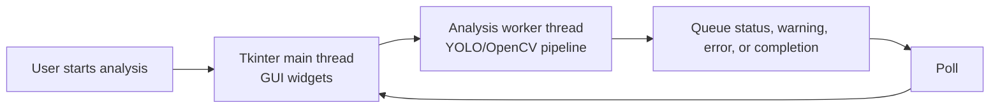

# Analysis Functionality

## Purpose

The Analysis workflow processes a recorded table-tennis video and produces review outputs.

It is responsible for:

```text
- Opening and validating a recording
- Detecting the table with a YOLO keypoint model
- Computing a stable table homography
- Detecting and tracking the active ball with YOLO
- Detecting bounce events from ball motion
- Mapping bounce locations onto a top-down table view
- Saving an annotated video
- Saving a bounce heatmap
- Merging analysis data into the Training-created session JSON
- Selecting a complete model version from the Analysis page
- Recording the selected model versions in the output name and session JSON
```

Analysis is offline by design. Training records a video first; analysis processes that saved file afterward.

---

## Main Files

| File | Responsibility |
| --- | --- |
| `gui/analysis_page.py` | Tkinter page for selecting recordings, starting analysis, and displaying milestone/frame progress and status messages. |
| `controller/analysis_controller.py` | Lists recordings, starts analysis in a background thread, and queues progress/results/errors back to the GUI. |
| `controller/analysis_controller_config.py` | Recording search path, valid recording extensions, threading toggle, status text. |
| `analysis/analysis.py` | Main pipeline coordinator. |
| `analysis/analysis_config.py` | Model paths, thresholds, frame limits, output toggles, heatmap/annotation settings. |
| `analysis/model_selection.py` | Discovers complete version folders, validates selections, resolves paths, and builds output tags. |
| `analysis/video_checker.py` | Opens video files and validates metadata/readability. |
| `analysis/table.py` | Loads the table pose model, detects corners/net posts, and stabilizes net positions. |
| `analysis/homography.py` | Computes stable table homography and maps image points to table coordinates. |
| `analysis/ball.py` | Loads the ball/player YOLO model and runs tracker-compatible candidate, active-ball, challenger, and bounce state. |
| `analysis/bounce.py` | Adapts tracker-owned bounce points for reporting, heatmaps, and JSON. |
| `analysis/annotate.py` | Draws table, candidate, challenger, active-ball, trail, bounce-state, and frame overlays. |
| `analysis/archived/` | Reference-only former implementations; see `analysis/archived/README.md`. |
| `analysis/heatmap.py` | Maps bounces to table space and generates heatmap outputs. |
| `analysis/log_json.py` | JSON-safe conversion plus session JSON load, merge, and save helpers. |

---

## End-to-End Pipeline

```mermaid
flowchart TD
    Recording[Recorded MKV] --> SelectVideo[User selects recording]
    Models[Complete folders in models/] --> SelectModels[User selects model version]
    SessionBefore[Existing _session.json if available] --> AnalysisController
    SelectVideo --> AnalysisPage[gui/analysis_page.py]
    AnalysisPage --> AnalysisController[controller/analysis_controller.py]
    SelectModels --> AnalysisPage

    AnalysisController --> Worker[Background worker with captured video and model selection]
    Worker --> RunAnalysis[analysis/analysis.py<br/>run_analysis(video_path)]

    RunAnalysis --> VideoCheck[video_checker.py<br/>Open and validate video]
    VideoCheck --> HomographySampling[Sample frames for table detection]
    HomographySampling --> TableModel[table.py<br/>Versioned table model]
    TableModel --> StableCorners[Stable table corners]
    StableCorners --> Homography[homography.py<br/>Compute table transform]

    Homography --> ResetVideo[Reset video to frame 0]
    ResetVideo --> BallModel[ball.py<br/>Versioned ball/player model]
    BallModel --> ActiveTrack[ball.py<br/>Tracker-compatible active, challenger, and bounce state]
    ActiveTrack --> BounceDetect[bounce.py<br/>Output adapter]

    BounceDetect --> MapBounces[Map bounce points through homography]
    MapBounces --> AnnotatedVideo[annotate.py<br/>Annotated MKV]
    MapBounces --> Heatmap[heatmap.py<br/>Heatmap PNG]
    MapBounces --> Result[Return analysis result]

    AnnotatedVideo --> ReviewAnnotated[review/annotated]
    Heatmap --> ReviewHeatmaps[review/heatmaps]
    Result --> AnalysisController
    AnalysisController --> Json[log_json.py<br/>Session JSON merge]
    Json --> SessionJson[capture/recording_json<br/>_session.json]

    ReviewAnnotated --> ReviewController[Review Controller]
    ReviewHeatmaps --> ReviewController
    SessionJson --> ReviewController
    ReviewController --> ReviewPage[Review Page]
```

---

## Pipeline Stages

### 1. Video Validation

`analysis/video_checker.py` verifies:

```text
- The selected file exists
- OpenCV can open it
- Width, height, FPS, and frame count are usable
- At least one frame can be read
- The capture can be reset to the start
```

This protects the rest of the pipeline from bad or incomplete recordings.

### 2. Table Detection

`analysis/table.py` loads the configured table model. With the current default:

```text
models/v2/table_pose_02.pt
```

The loader caches both the model and its resolved path. Reusing the same path is
fast; requesting another version releases the old cached model before loading
the new one.

The table model is expected to return keypoints in this order:

```text
0 = bottom-left corner
1 = bottom-right corner
2 = top-right corner
3 = top-left corner
4 = left net point, if present
5 = right net point, if present
```

Homography still uses only the first four corner points. Net-post keypoints 4
and 5 are retained and stabilized separately so their average vertical position
defines the launch region's bottom edge. The rectangle extends from the top of
the video (`y=0`) down to that net boundary. If the selected table model does
not provide valid posts, the configured `BALL_LAUNCH_Y_MAX_FRAC` is used as a
fallback. Ball selection, challenger filtering, bounce exclusion, and the cyan
annotation all consume this same rectangle.

### 3. Stable Homography

`analysis/homography.py` computes a stable table transform instead of trusting one frame.

The pipeline:

```text
Sample frames from a time window
Detect table corners on each sample
Undistort every detected corner with the saved fisheye profile
Reject invalid or outlier detections
Compute median/stable corners
Build one final homography matrix
Undistort bounce/speed points with the same profile
Map corrected coordinates to top-down table coordinates
```

The configured real table dimensions are:

```text
Length: 2740 mm
Width: 1525 mm
```

This homography is what lets the system convert an image-space bounce into a table-space bounce.

### 4. Ball Detection and Active Tracking

`analysis/ball.py` loads the configured ball/player model. With the current default:

```text
models/v2/ball_player_detect_02.pt
```

The ball loader uses the same path-aware cache rule, allowing v1 followed by v2
without restarting the GUI.

Current class IDs:

```text
BALL_CLASS_ID = 0
PLAYER_CLASS_ID = 1
```

The active-ball tracker:

```text
- Detects ball candidates in each frame
- Scores initial candidates using confidence, motion, and launch region
- Predicts the active track position
- Matches the best continuation candidate
- Handles misses
- Allows challenger balls to replace the active track after confirmation
- Arms and confirms at most one bounce per active track
- Resets pending bounce state when a track initializes, switches, or drops
- Stores recent positions and an active trail
```

Player detection is available at the model/config level, but player-specific metrics are not yet surfaced as a complete pipeline.

### 5. Bounce Detection

The active algorithm runs inside `analysis/ball.py` in the same order as the
original `BallTracker.update()` method. `analysis/bounce.py` does not independently
detect motion; it converts newly registered tracker points into the richer event
shape required by heatmaps and JSON.

Bounce detection is based on:

```text
Floating-point bounding-box-bottom positions
Nine-position rolling history
Three-point moving-median smoothing
Fitted incoming slope from 3–4 points
Fitted outgoing slope from 2–3 points
Flat-frame-tolerant contact plateau
Cooldown frames to avoid duplicate bounce events
Minimum track updates before trusting a bounce
Ignoring bounce arming/confirmation inside the launch region
One registered bounce per active track
Bounce-state reset during initialization, challenger switch, and track drop
```

The output records raw image position for annotation, undistorted image
position, table pixels, normalized table position, physical millimetres, and
timing data.

When a bounce is confirmed, `analysis/speed.py` uses the recent incoming track
positions before the reversal frame to estimate speed. Each bbox-bottom point
is first corrected with the same fisheye profile used by the homography, then
projected through the table homography, converted from table pixels to real
table millimetres, and divided by video timestamp differences. Invalid table
mappings, implausible physical speeds, track discontinuities, and isolated
segment-speed outliers are rejected. A valid bounce records
`estimated_speed_kmh`, `speed_sample_count`, and the
`pre_bounce_table_plane` method name.

This is an estimated two-dimensional table-plane speed from one camera. It does
not measure vertical motion and should not be presented as radar-accurate 3D
ball speed.

The current implementation uses a short temporal vertical-trajectory reversal,
not an angle threshold. It tolerates flat frames around shallow contact and
records the fitted contact frame rather than the later confirmation frame. See
[Bounce Detection Improvement Plan](bounce_detection_improvement_plan.md) for
the diagnostic-first roadmap toward confidence scoring, table gating, and
perspective normalization.

### 6. Annotation

`analysis/annotate.py` creates an offline annotated video.

Possible overlays include:

```text
- Frame/time information
- Table outline
- Green candidate boxes with confidence and motion
- Purple pending challenger with confirmation progress
- Red active ball with confidence and velocity
- Blue active trail
- Yellow bounce points, last bounce, armed state, and cooldown
- Ball trail
- Bounce markers
- Optional mini heatmap overlay
```

Annotated videos are saved to:

```text
review/annotated/
```

### 7. Heatmap

`analysis/heatmap.py` maps bounce events through the homography and draws a top-down table heatmap.

Heatmaps are saved to:

```text
review/heatmaps/
```

The heatmap module can also maintain live heatmap state during annotation so the annotated video can show a mini table overlay.

### 8. Session JSON Integration

`analysis/log_json.py` contains utilities to build JSON-safe data and merge the
analysis result into the session record created during Training.

It can represent:

```text
- Session metadata
- Video metadata
- Table corners
- Homography data
- Bounce positions
- Per-bounce estimated return speeds
- Average/fastest estimated return-speed summary
- Summary metrics
- Quality flags
```

`run_analysis()` returns a Python dictionary. After it completes,
`AnalysisController` loads the matching `_session.json` and merges the result.
When an older or imported video has no record, the controller creates the same
schema with empty Training settings and `session_origin: analysis_only` before
merging. New filenames always use `<recording_stem>_session.json`; friendly
custom names remain inside `session.session_name`.

---

## Threading Model

The GUI should stay responsive while analysis runs.



Important rule:

```text
The analysis worker thread should not update Tkinter widgets directly.
```

The controller sends status and structured progress dictionaries through a
queue. The Analysis page polls that queue and updates the GUI safely.

### GUI progress reporting

`run_analysis()` accepts an optional progress callback. Direct terminal runs do
not need to provide one. The controller supplies a callback for GUI runs and
forwards each event through its existing thread-safe message queue.

The determinate progress display uses these milestones:

```text
5%    analysis started
10%   video opened and validated
25%   table detected
35%   homography calculated
40-95% ball tracking, bounce detection, and frame processing
96-99% output generation, result packaging, and session JSON merge
100%  completed
```

The frame stage calculates its percentage from `frames_analyzed / total_frames`
and reports only when the displayed percentage changes or a bounce is detected.
This avoids flooding the GUI queue. Bounce detection is part of the active-ball
frame loop, so the page shows its live count alongside frame progress rather
than presenting it as a separate pass. Player-specific progress is intentionally
not shown because the current pipeline does not produce player metrics.

When the user selects a recording, the controller checks for the matching
`<recording_stem>_session.json`. A JSON file is treated as previously analyzed
only when it contains real analysis evidence: recorded model metadata, a
positive processed-frame count, or a saved analysis artifact. Empty Training
placeholders therefore leave the progress panel in its startup state.

For a previously analyzed recording, the page reconstructs the completed
milestones, frame count, bounce count, table/homography status, and model version
from the session JSON. Older analyzed records without `analysis_models` still
show their saved progress but omit the model label. Displaying a prior model does
not change the model selected for the next run.

Successful analysis also records `summary.analysis_processing_time_seconds`.
The timer covers `run_analysis()` through artifact generation and video cleanup;
it does not include the controller's later session-JSON merge. Live and historical
progress displays format the value as `Completed (23.45s)`. Older records without
the optional field continue to show `Completed`.

---

## Output Files

Current output locations:

```text
review/annotated/
    annotate_[recording_name]_[model tag].mkv

review/heatmaps/
    heatmap_[recording_name].png

capture/recording_json/
    [recording_name]_session.json
```

The Review page uses session JSON to show bounce count, ball-detection rate,
table status, and the referenced heatmap. It also resolves the annotated-video
artifact and can open it directly in VLC.

When both models use v2, the model tag is `v2`. If separate selectors are added
later, a mixed selection uses a tag such as `table-v1_ball-v2`.

---

## Current Status

Working or mostly connected:

```text
- Recording selection from capture/recordings
- Background-thread analysis
- Milestone progress bar with live frame and bounce counts
- Video validation
- YOLO table keypoint detection
- Stable homography
- YOLO ball detection
- Active ball tracking
- Bounce detection
- Annotated MKV output
- Heatmap PNG output
```

Still improving:

```text
- End-to-end verification of the session JSON merge
- Consistent JSON identity and filename generation
- Accepted/rejected bounce reporting
- Quantitative accuracy validation
- Player-specific metrics
- More detailed GUI result summaries
```

---

## Design Rules

```text
analysis_page.py should not contain YOLO or OpenCV pipeline logic.
analysis_controller.py should only coordinate analysis startup and status.
analysis/analysis.py should coordinate the CV pipeline.
table.py should own table model inference.
ball.py should own the tracker-compatible active-ball, challenger, and bounce state machine.
bounce.py should only adapt tracker bounce points for downstream consumers.
annotate.py and heatmap.py should generate review outputs without controlling the GUI.
```
