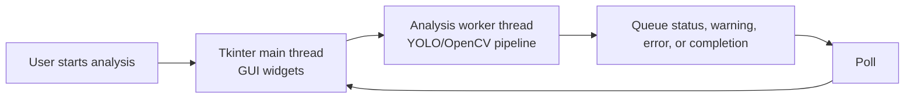

# Analysis Functionality

## Purpose

The Analysis workflow processes a recorded table-tennis video and produces review outputs.

It is responsible for:

```text
- Opening and validating a recording
- Detecting the table with a YOLO keypoint model
- Computing a stable table homography
- Detecting and tracking the active ball with YOLO
- Detecting bounce events from ball motion
- Mapping bounce locations onto a top-down table view
- Saving an annotated video
- Saving a bounce heatmap
- Merging analysis data into the Training-created session JSON
```

Analysis is offline by design. Training records a video first; analysis processes that saved file afterward.

---

## Main Files

| File | Responsibility |
| --- | --- |
| `gui/analysis_page.py` | Tkinter page for selecting recordings, starting analysis, and displaying status messages. |
| `controller/analysis_controller.py` | Lists recordings, starts analysis in a background thread, and queues results/errors back to the GUI. |
| `controller/analysis_controller_config.py` | Recording search path, valid recording extensions, threading toggle, status text. |
| `analysis/analysis.py` | Main pipeline coordinator. |
| `analysis/analysis_config.py` | Model paths, thresholds, frame limits, output toggles, heatmap/annotation settings. |
| `analysis/video_checker.py` | Opens video files and validates metadata/readability. |
| `analysis/table.py` | Loads the table keypoint YOLO model and detects table corners. |
| `analysis/homography.py` | Computes stable table homography and maps image points to table coordinates. |
| `analysis/ball.py` | Loads the ball/player YOLO model, detects ball candidates, and tracks the active ball. |
| `analysis/bounce.py` | Detects bounces from active-ball vertical motion. |
| `analysis/annotate.py` | Draws table, ball, trail, bounce, and frame overlays into an output video. |
| `analysis/heatmap.py` | Maps bounces to table space and generates heatmap outputs. |
| `analysis/log_json.py` | JSON-safe conversion plus session JSON load, merge, and save helpers. |

---

## End-to-End Pipeline

```mermaid
flowchart TD
    Recording[Recorded MKV] --> SelectVideo[User selects recording]
    SessionBefore[Initial _session.json] --> AnalysisController
    SelectVideo --> AnalysisPage[gui/analysis_page.py]
    AnalysisPage --> AnalysisController[controller/analysis_controller.py]

    AnalysisController --> Worker[Background worker thread]
    Worker --> RunAnalysis[analysis/analysis.py<br/>run_analysis(video_path)]

    RunAnalysis --> VideoCheck[video_checker.py<br/>Open and validate video]
    VideoCheck --> HomographySampling[Sample frames for table detection]
    HomographySampling --> TableModel[table.py<br/>YOLO table_keypoints.pt]
    TableModel --> StableCorners[Stable table corners]
    StableCorners --> Homography[homography.py<br/>Compute table transform]

    Homography --> ResetVideo[Reset video to frame 0]
    ResetVideo --> BallModel[ball.py<br/>YOLO ball_player_detect.pt]
    BallModel --> ActiveTrack[Active ball tracking]
    ActiveTrack --> BounceDetect[bounce.py<br/>Bounce detection]

    BounceDetect --> MapBounces[Map bounce points through homography]
    MapBounces --> AnnotatedVideo[annotate.py<br/>Annotated MKV]
    MapBounces --> Heatmap[heatmap.py<br/>Heatmap PNG]
    MapBounces --> Result[Return analysis result]

    AnnotatedVideo --> ReviewAnnotated[review/annotated]
    Heatmap --> ReviewHeatmaps[review/heatmaps]
    Result --> AnalysisController
    AnalysisController --> Json[log_json.py<br/>Session JSON merge]
    Json --> SessionJson[capture/recordings<br/>_session.json]

    ReviewAnnotated --> ReviewController[Review Controller]
    ReviewHeatmaps --> ReviewController
    SessionJson --> ReviewController
    ReviewController --> ReviewPage[Review Page]
```

---

## Pipeline Stages

### 1. Video Validation

`analysis/video_checker.py` verifies:

```text
- The selected file exists
- OpenCV can open it
- Width, height, FPS, and frame count are usable
- At least one frame can be read
- The capture can be reset to the start
```

This protects the rest of the pipeline from bad or incomplete recordings.

### 2. Table Detection

`analysis/table.py` loads:

```text
models/table_keypoints.pt
```

The table model is expected to return keypoints in this order:

```text
0 = bottom-left corner
1 = bottom-right corner
2 = top-right corner
3 = top-left corner
4 = left net point, if present
5 = right net point, if present
```

Homography only needs the first four corner points. Extra net keypoints are ignored by the current mapping stage.

### 3. Stable Homography

`analysis/homography.py` computes a stable table transform instead of trusting one frame.

The pipeline:

```text
Sample frames from a time window
Detect table corners on each sample
Reject invalid or outlier detections
Compute median/stable corners
Build one final homography matrix
Map image coordinates to top-down table coordinates
```

The configured real table dimensions are:

```text
Length: 2740 mm
Width: 1525 mm
```

This homography is what lets the system convert an image-space bounce into a table-space bounce.

### 4. Ball Detection and Active Tracking

`analysis/ball.py` loads:

```text
models/ball_player_detect.pt
```

Current class IDs:

```text
BALL_CLASS_ID = 0
PLAYER_CLASS_ID = 1
```

The active-ball tracker:

```text
- Detects ball candidates in each frame
- Scores initial candidates using confidence, motion, and launch region
- Predicts the active track position
- Matches the best continuation candidate
- Handles misses
- Allows challenger balls to replace the active track after confirmation
- Stores recent positions and an active trail
```

Player detection is available at the model/config level, but player-specific metrics are not yet surfaced as a complete pipeline.

### 5. Bounce Detection

`analysis/bounce.py` receives active-ball positions from `ball.py`.

It does not run YOLO and does not choose the active ball. It only looks at the active ball's motion.

Bounce detection is based on:

```text
Strong downward velocity
Lowest pending contact point
Strong upward velocity after the downward motion
Cooldown frames to avoid duplicate bounce events
Minimum track updates before trusting a bounce
Optional use of bounding-box bottom as the contact y-coordinate
Optional ignoring of launch-region positions
```

The output is a list of bounce events with image-space location and timing data.

### 6. Annotation

`analysis/annotate.py` creates an offline annotated video.

Possible overlays include:

```text
- Frame/time information
- Table outline
- Active ball box/center
- Ball trail
- Bounce markers
- Optional mini heatmap overlay
```

Annotated videos are saved to:

```text
review/annotated/
```

### 7. Heatmap

`analysis/heatmap.py` maps bounce events through the homography and draws a top-down table heatmap.

Heatmaps are saved to:

```text
review/heatmaps/
```

The heatmap module can also maintain live heatmap state during annotation so the annotated video can show a mini table overlay.

### 8. Session JSON Integration

`analysis/log_json.py` contains utilities to build JSON-safe data and merge the
analysis result into the session record created during Training.

It can represent:

```text
- Session metadata
- Video metadata
- Table corners
- Homography data
- Bounce positions
- Summary metrics
- Quality flags
```

`run_analysis()` returns a Python dictionary. After it completes,
`AnalysisController` loads the matching `_session.json`, merges the result, and
saves it. A missing session file or merge error produces a warning so the
analysis workflow can still complete.

Important current limitation: Training can name the JSON from a custom session
name, while Analysis derives the expected JSON path from the MKV stem. These
must be made consistent for reliable end-to-end merging.

---

## Threading Model

The GUI should stay responsive while analysis runs.



Important rule:

```text
The analysis worker thread should not update Tkinter widgets directly.
```

The controller sends status dictionaries through a queue. The Analysis page polls that queue and updates the GUI safely.

---

## Output Files

Current output locations:

```text
review/annotated/
    annotate_[recording_name].mkv

review/heatmaps/
    heatmap_[recording_name].png

capture/recordings/
    [recording_name]_session.json
```

The Review page uses session JSON to show bounce count, ball-detection rate,
table status, and the referenced heatmap. Annotated-video playback remains
future-facing.

---

## Current Status

Working or mostly connected:

```text
- Recording selection from capture/recordings
- Background-thread analysis
- Video validation
- YOLO table keypoint detection
- Stable homography
- YOLO ball detection
- Active ball tracking
- Bounce detection
- Annotated MKV output
- Heatmap PNG output
```

Still improving:

```text
- End-to-end verification of the session JSON merge
- Consistent JSON identity and filename generation
- Accepted/rejected bounce reporting
- Quantitative accuracy validation
- Player-specific metrics
- More detailed GUI result summaries
```

---

## Design Rules

```text
analysis_page.py should not contain YOLO or OpenCV pipeline logic.
analysis_controller.py should only coordinate analysis startup and status.
analysis/analysis.py should coordinate the CV pipeline.
table.py should own table model inference.
ball.py should own active-ball tracking.
bounce.py should only reason about active-ball motion.
annotate.py and heatmap.py should generate review outputs without controlling the GUI.
```
