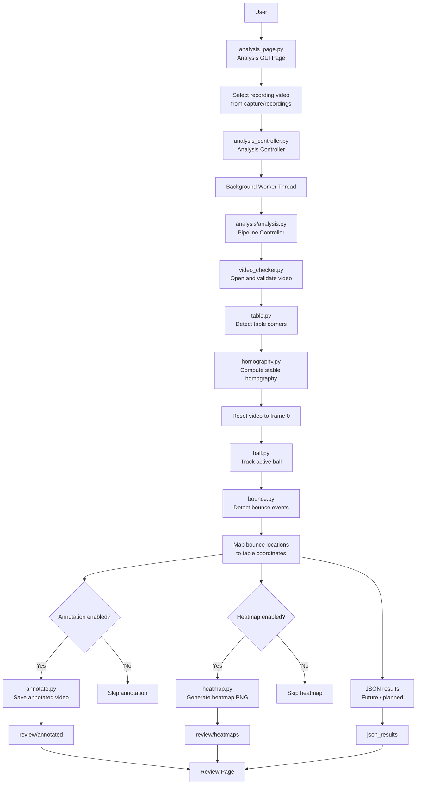
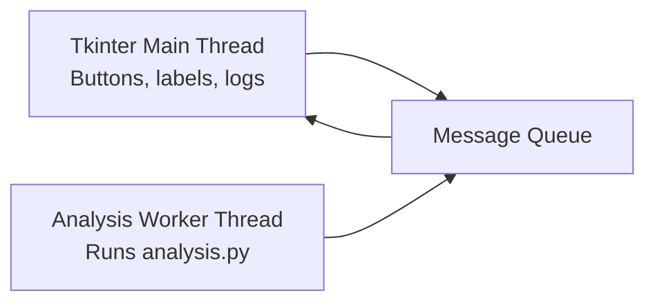

# Analysis Pipeline

## Purpose

This document describes the computer vision Analysis workflow for the table-tennis training assistant.

The Analysis workflow is responsible for processing a recorded table-tennis video and generating review outputs.

The current Analysis pipeline can:

```text
- Open and validate a recorded video
- Detect the table
- Compute table homography
- Track the active ball
- Detect bounce events
- Map bounce locations onto the table
- Generate an annotated video
- Generate a bounce heatmap
```

The Analysis page and Analysis Controller should not contain YOLO logic, OpenCV processing logic, homography math, or bounce detection logic. Those details belong inside the `analysis/` modules.

---

## Current Analysis Status

Current working features:

```text
- Analysis page lists recorded videos.
- User can select a video from capture/recordings.
- Analysis Controller starts analysis in a background thread.
- analysis.py runs the full computer vision pipeline.
- Annotated videos are saved to review/annotated.
- Heatmaps are saved to review/heatmaps.
```

Still planned or improving:

```text
- Richer JSON result export
- Better accepted/rejected bounce reporting
- More detailed GUI result summary
- More quantitative validation metrics
```

---

## Analysis Workflow Flowchart



---

## Analysis Pipeline Steps

The intended Analysis sequence is:

```text
User selects a recording
↓
Analysis Controller starts analysis
↓
Video is opened and checked
↓
Table corners are detected
↓
Homography is computed
↓
Video is reset to frame 0
↓
Ball is tracked frame-by-frame
↓
Bounce events are detected
↓
Bounce locations are mapped to table coordinates
↓
Annotated video is optionally saved
↓
Heatmap image is optionally generated
↓
Results are made available for Review
```

---

## Analysis Controller Responsibilities

`controller/analysis_controller.py` is responsible for:

```text
- Listing available recording videos
- Starting analysis from one controller method
- Running analysis in a background thread
- Sending status messages back to the GUI
- Reporting completion or errors
```

It should not contain:

```text
- YOLO inference
- OpenCV frame processing
- Homography math
- Ball tracking logic
- Bounce detection logic
- Heatmap drawing logic
```

---

## Analysis Module Responsibilities

| File                          | Responsibility                                                 |
| ----------------------------- | -------------------------------------------------------------- |
| `analysis/analysis.py`        | Main computer vision pipeline controller                       |
| `analysis/analysis_config.py` | Analysis paths, model paths, toggles, and thresholds           |
| `analysis/video_checker.py`   | Opens video, validates metadata, confirms frames are readable  |
| `analysis/table.py`           | Loads table model and detects table keypoints                  |
| `analysis/homography.py`      | Computes homography and maps image points to table coordinates |
| `analysis/ball.py`            | Detects ball candidates and tracks the active ball             |
| `analysis/bounce.py`          | Detects bounce events from ball motion                         |
| `analysis/annotate.py`        | Draws offline annotations onto video frames                    |
| `analysis/heatmap.py`         | Generates top-down bounce heatmaps                             |

---

## Analysis Threading Model

The GUI should remain responsive while analysis runs.

Current threading model:



Important rule:

```text
The analysis worker thread should not directly update Tkinter widgets.
```

Correct pattern:

```text
Analysis worker thread
↓
puts message in queue
↓
Tkinter page polls queue
↓
Tkinter page updates labels, buttons, and logs
```

---

## Output Files

Current review outputs:

```text
review/annotated/
    Annotated MKV videos

review/heatmaps/
    Heatmap PNG images

json_results/
    Future or planned JSON result files
```

Example output names:

```text
annotate_sample_001.mkv
heatmap_sample_001.png
```

---

## Optional Output Rule

Annotation and heatmap generation should be useful but not fragile.

Important rule:

```text
If annotation fails, core bounce data should still be useful.
If heatmap generation fails, ball tracking and bounce detection should still be useful.
If review output fails, the analysis pipeline should still report what completed.
```

This keeps the project robust.

---

## Current Limitations

Known limitations:

```text
- Homography accuracy depends on table corner quality.
- Ball tracking can fail when the ball is blurred or occluded.
- Bounce detection can produce false positives if the track jumps.
- Bounce detection can miss events if the ball is lost near the table.
- Current validation is mostly visual.
- JSON output should become richer and easier for the GUI to display.
```

---

## Next Analysis Development Steps

Recommended next steps:

```text
1. Improve run_analysis() return dictionary.
2. Include output paths in the result dictionary.
3. Include bounce count and mapped/rejected bounce counts.
4. Save accepted and rejected bounce data to JSON.
5. Improve bounce filtering.
6. Add better validation metrics.
7. Display result summary in the Analysis GUI.
```

---

## Summary

The Analysis workflow is the core computer vision workflow of the project.

The main design is:

```text
Analysis page
↓
Analysis Controller
↓
analysis.py
↓
Focused analysis modules
↓
Saved review outputs
```

This keeps the GUI clean, the controller focused, and the computer vision pipeline modular.
