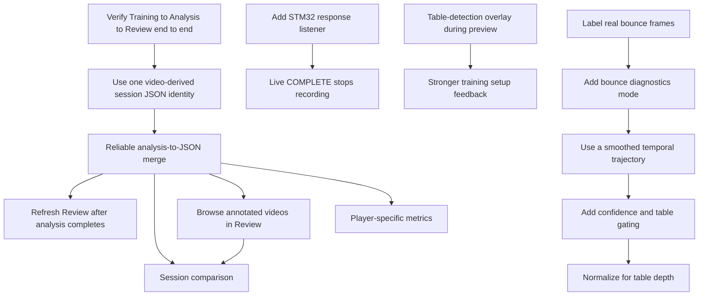

# Backlog

This file tracks active work for future agents and developers. Implement each
item as a small checkpoint, with direct tests before GUI wiring when possible.

## Work Dependency Map

Use this diagram as the rough order of work. Items near the top unblock items
below them.

## High Priority

- [x] Reconcile system and workflow documentation with the session JSON pipeline.
- [ ] Run Training → Analysis → Review end to end on the Jetson.
- [ ] Make Training always write `<recording_stem>_session.json`; keep the custom name only in `session.session_name`.
- [ ] Add a direct path-contract test proving Training, Analysis, and Review resolve the same session JSON for blank, custom, and punctuation-heavy display names.
- [ ] Add STM32 response listener so live `COMPLETE` stops recording automatically without sending `STOP`.
- [ ] Add a safe hardware test profile that disables real recording and real STM32 writes together; document the exact command before running controller tests.
- [ ] Label real bounce frames in at least one representative recording.
- [ ] Add bounce diagnostics and rejection reasons before changing thresholds.

## Medium Priority

- [x] Show initial JSON-backed Review stats: bounce count, detection rate, and table status.
- [x] Add annotated video browsing/opening from Review (2026-07-15).
- [ ] Refresh Review automatically after analysis completes.
- [ ] Add table-detection overlay during preview.
- [x] Replace consecutive-frame bounce reversal with a smoothed temporal window (2026-07-15).
- [ ] Add track-stability and table-region checks to bounce candidates.
- [ ] Remove or rename stale placeholder methods, status constants, and docstrings after the real Training path is verified on Jetson.
- [ ] Decide whether session artifact paths are project-relative or absolute, then make Training, Analysis, and Review resolve them consistently across host and container paths.
- [ ] Add a repository test/validation guide covering safe local tests, Jetson-only tests, hardware-changing tests, expected outputs, and common failures.

## Later

- [ ] Add player-specific metrics.
- [ ] Add session comparison.
- [ ] Improve optional external viewer behavior for Jetson/Docker environments.
- [ ] Normalize bounce thresholds for near, middle, and far table regions.
- [ ] Add a dependency/environment manifest for Python, OpenCV, Ultralytics,
  GStreamer, Tkinter, CUDA/Torch, camera access, and serial permissions.
- [ ] Consolidate or clearly retire duplicate legacy configuration paths such as
  unused model/output constants in `capture/recording_config.py`.

## Verified Checkpoints

- [x] Active Python files compile when bytecode is redirected to a writable temp directory (2026-07-14).
- [x] Tracker state-order and table net-post regression test passes (2026-07-14).
- [x] README distinguishes connected Training/Analysis/Review paths from remaining work (2026-07-14).
