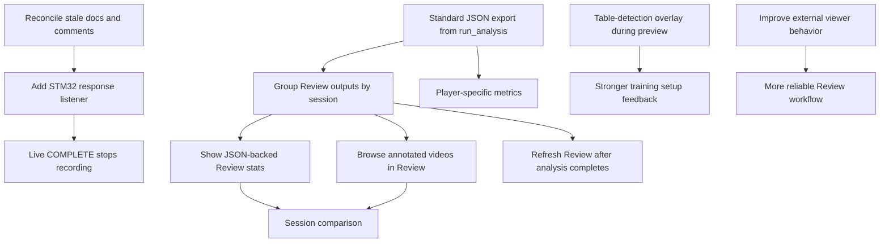

# Backlog

This file tracks active work for future agents and developers. Implement each
item as a small checkpoint, with direct tests before GUI wiring when possible.

## Work Dependency Map

Use this diagram as the rough order of work. Items near the top unblock items
below them.

## High Priority

- [ ] Reconcile stale docs/comments about recording and preview placeholders with current real `MjpegRecorder` and `CameraPreviewService` code.
- [ ] Add STM32 response listener so live `COMPLETE` stops recording automatically without sending `STOP`.
- [ ] Make JSON export a standard output of `run_analysis()`.
- [ ] Group Review outputs by session: source recording, annotated video, heatmap, and JSON.

## Medium Priority

- [ ] Show JSON-backed Review stats such as bounce count and placement summary.
- [ ] Add annotated video browsing/opening from Review.
- [ ] Refresh Review automatically after analysis completes.
- [ ] Add table-detection overlay during preview.

## Later

- [ ] Add player-specific metrics.
- [ ] Add session comparison.
- [ ] Improve optional external viewer behavior for Jetson/Docker environments.
