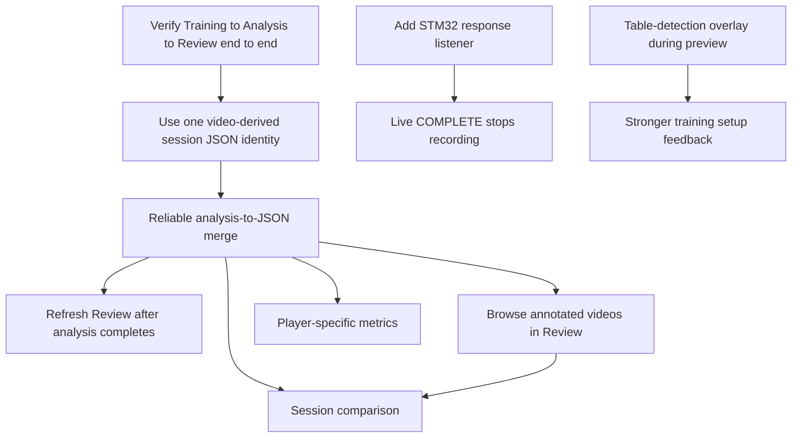

# Backlog

This file tracks active work for future agents and developers. Implement each
item as a small checkpoint, with direct tests before GUI wiring when possible.

## Work Dependency Map

Use this diagram as the rough order of work. Items near the top unblock items
below them.

## High Priority

- [x] Reconcile system and workflow documentation with the session JSON pipeline.
- [ ] Run Training → Analysis → Review end to end on the Jetson.
- [ ] Give every session one video-derived JSON filename so custom display names cannot break the Analysis merge.
- [ ] Add STM32 response listener so live `COMPLETE` stops recording automatically without sending `STOP`.

## Medium Priority

- [x] Show initial JSON-backed Review stats: bounce count, detection rate, and table status.
- [ ] Add annotated video browsing/opening from Review.
- [ ] Refresh Review automatically after analysis completes.
- [ ] Add table-detection overlay during preview.

## Later

- [ ] Add player-specific metrics.
- [ ] Add session comparison.
- [ ] Improve optional external viewer behavior for Jetson/Docker environments.
