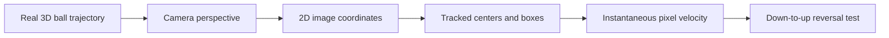
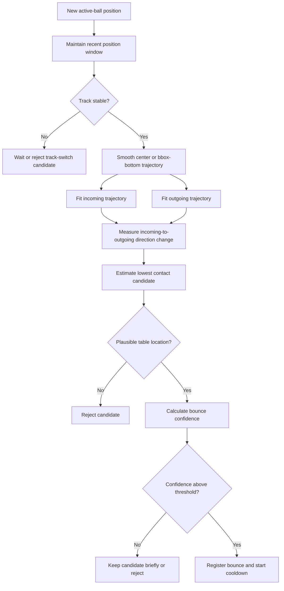

# Bounce Detection Improvement Plan

## Purpose

This document records how the current bounce detector works, why real table
bounces can be missed, and the recommended path for improving it.

The main development rule is:

```text
Measure the current failure before changing thresholds.
```

Ball and table detection can be accurate while bounce detection is still
unreliable. Detecting an object and interpreting its motion are different
problems.

---

## Current Algorithm

The current detector lives in `analysis/bounce.py`. It does not use an angle
threshold. It uses an instantaneous vertical-velocity reversal in image space.

In image coordinates:

```text
positive vy = moving down the image
negative vy = moving up the image
```

The current confirmation condition is approximately:

```text
Bounce detector is armed
Cooldown is zero
Previous vy > BOUNCE_VY_DOWN_THRESHOLD
Current vy < -BOUNCE_VY_UP_THRESHOLD
```

Current defaults in `analysis/analysis_config.py`:

```text
BOUNCE_VY_DOWN_THRESHOLD = 60.0 pixels/second
BOUNCE_VY_UP_THRESHOLD = 60.0 pixels/second
BOUNCE_COOLDOWN_FRAMES = 6
BOUNCE_MIN_TRACK_UPDATES = 3
BOUNCE_USE_BBOX_BOTTOM = True
BOUNCE_IGNORE_LAUNCH_REGION = True
```

The ball velocity is calculated in `analysis/ball.py` from two consecutive
tracked centers:

```text
vy = (new_y - old_y) / delta_time
```

The detector stores the lowest image point observed while the ball is moving
downward. If the next trusted movement reverses strongly upward, that stored
point becomes the bounce location.

---

## Why Real Bounces Can Be Missed

The physical trajectory is three-dimensional, but the algorithm observes a
two-dimensional camera projection.



Important failure modes:

- A near bounce produces more pixel movement than a far bounce.
- Horizontal movement may dominate the image-space vertical component.
- A real rebound may not immediately reverse image `y` because of perspective.
- One missed ball detection can skip the exact reversal frame.
- Bounding-box jitter can create unstable velocity.
- An active-track switch can look like a sudden direction change.
- Launch-region filtering can exclude valid early motion.
- A fixed pixel threshold has a different physical meaning across the table.

The key limitation is not simply that the thresholds may be wrong. The current
detector depends on one pair of frames representing the whole bounce.

---

## Key Design Decision

Replace the single-frame decision with a short temporal trajectory decision.

Current approach:

```text
One strong downward frame
One strong upward frame
Register bounce immediately
```

Recommended approach:

```text
Collect recent trusted positions
Smooth the trajectory
Estimate incoming motion over multiple points
Estimate outgoing motion over multiple points
Check track stability and table plausibility
Calculate a bounce confidence score
Confirm or reject the candidate
```

This keeps `bounce.py` independent from YOLO while giving it better motion
evidence.

---

## Proposed Future Detector



---

## Phase 1: Diagnostics Before Tuning

The first implementation should make missed bounces explainable.

For every trusted active-ball update, record:

```text
frame index and timestamp
center x and y
bbox bottom y
bounding-box width and height
confidence
vx and vy
smoothed vx and vy, when added
track update count
track initialized/switched/dropped flags
miss count
launch-region state
bounce armed state
cooldown
pending contact point
table-region result
candidate score
accept/reject reason
```

Optional annotation overlay:

```text
vy: 86 px/s
smoothed vy: -42 px/s
bounce state: ARMED
candidate score: 0.71
decision: waiting for outgoing evidence
```

Suggested rejection reasons:

```text
track_too_new
track_switched
insufficient_incoming_motion
insufficient_outgoing_motion
outside_table_region
cooldown_active
low_confidence
trajectory_incomplete
```

### Phase 1 checkpoint

- Choose at least one recording with manually identified bounce frames.
- Export diagnostic values around each real bounce.
- Identify whether failures come from velocity, missing frames, perspective,
  track switching, or filtering.
- Do not broadly lower thresholds until this evidence exists.

---

## Phase 2: Temporal Trajectory Detection

Maintain a rolling history of approximately 7–9 trusted positions.

Possible initial configuration:

```text
BOUNCE_HISTORY_FRAMES = 9
BOUNCE_INCOMING_MIN_POINTS = 3
BOUNCE_OUTGOING_MIN_POINTS = 2
BOUNCE_CONFIRMATION_WINDOW_FRAMES = 4
BOUNCE_MAX_MISSING_FRAMES = 2
```

These are starting points, not confirmed final values.

The detector should:

1. Smooth recent `y` or bbox-bottom values.
2. Estimate incoming slope from several points.
3. Keep the lowest/contact candidate pending.
4. Allow a small number of missed detections.
5. Estimate outgoing slope from several points.
6. Confirm only after enough outgoing evidence exists.

Potential smoothing methods:

- Exponential moving average: simple and inexpensive.
- Moving median: robust against one jittering detection.
- Short quadratic fit: matches the curved shape of a ball trajectory.
- Savitzky-Golay filtering: useful later if dependency and window constraints
  are acceptable.

Recommended first implementation: moving median or short quadratic fit. Keep
the raw positions for diagnostics.

### Phase 2 checkpoint

- A missing detection at the contact frame does not automatically lose the
  bounce.
- One jittering box does not create a bounce.
- The detector can explain the incoming and outgoing point sets it used.
- Existing direct synthetic tests still pass.

---

## Phase 3: Direction Change and Confidence Scoring

The incoming and outgoing two-dimensional velocity vectors can be compared:

```text
incoming velocity = average or fitted motion before contact
outgoing velocity = average or fitted motion after contact
direction change = angle between the two vectors
```

This is where an angle measurement can help. It should be one part of the
decision, not the entire detector. A large angle can also result from jitter or
a track switch.

Possible confidence inputs:

| Signal | Higher confidence when |
| --- | --- |
| Incoming motion | A stable incoming trend exists. |
| Outgoing motion | A stable post-contact trend exists. |
| Direction change | The fitted motion changes significantly. |
| Curvature | The trajectory has a plausible contact turning point. |
| Track stability | The same active track exists before and after contact. |
| Detection confidence | Ball detections remain credible. |
| Table plausibility | The estimated contact lies in or near the table region. |
| Missing frames | Few frames are missing around contact. |

The score and individual components should be saved with accepted and rejected
candidates so the system remains tunable.

---

## Phase 4: Table and Perspective Awareness

### Table-region gate

The detected table polygon can reject candidates clearly outside the table.
This is a plausibility check, not proof of contact.

The table homography assumes that a point lies on the table plane. Applying it
to an airborne ball does not recover the ball's true 3D position. Homography is
most useful near the estimated contact moment.

Use homography to ask:

```text
Could this candidate plausibly be on the table?
```

Do not use it to claim:

```text
This is the exact 3D trajectory of the airborne ball.
```

### Perspective-aware thresholds

A fixed pixel velocity represents different physical motion at different table
depths. Possible improvements:

1. Divide the table into near, middle, and far regions.
2. Measure typical incoming and outgoing velocities in each region.
3. Use region-specific thresholds.
4. Later, normalize velocity using the local apparent table scale.

The ball bounding-box size may provide a weak depth clue. It should only be a
supporting signal because box size also changes with blur and detector jitter.

### Phase 4 checkpoint

- Near and far bounces have comparable detection rates.
- Candidates clearly outside the table are rejected.
- The detector records which perspective region and thresholds were used.

---

## Optional Future Sensors

### Audio fusion

A microphone can identify impact-time candidates. Vision can then inspect a
short window around the sound.

```text
Audio impact candidate
        +
Visual trajectory change
        =
Higher-confidence bounce
```

Paddle hits and launcher sounds must be distinguished from table impacts.

### Multiple cameras

A second synchronized camera enables approximate 3D triangulation. This is the
strongest geometric improvement but requires camera calibration,
synchronization, and more computation.

Use the software-only temporal detector before expanding the hardware.

---

## Evaluation Plan

Create a small labeled validation set before comparing algorithms.

For each recording, record the manually observed bounce frame or time. Evaluate:

```text
True positives: real bounces correctly detected
False positives: detected events that were not table bounces
False negatives: real bounces that were missed
Timing error: detected frame minus labeled frame
Location error: estimated contact position compared with manual position
```

Recommended metrics:

```text
precision = true positives / all detected bounces
recall = true positives / all real bounces
F1 score = balance between precision and recall
median absolute timing error in frames
```

Evaluate near, middle, and far table regions separately. A single overall score
can hide a perspective problem.

---

## Development Order

```mermaid
flowchart LR
    Baseline[Save current detector baseline] --> Labels[Label real bounce frames]
    Labels --> Diagnostics[Add diagnostic export and overlays]
    Diagnostics --> Window[Implement temporal history]
    Window --> Smooth[Add smoothing and fitted slopes]
    Smooth --> Score[Add confidence scoring]
    Score --> Table[Add table-region gate]
    Table --> Perspective[Add perspective normalization]
    Perspective --> Compare[Compare against baseline]
```



Keep each checkpoint independently testable. Avoid changing tracking, bounce
logic, perspective normalization, and thresholds in one large change because it
would be difficult to identify which change improved or broke detection.

---

## Recommended Next Task

Build a bounce-diagnostics mode for one real recording with known bounce times.
The mode should export recent active-ball positions, state transitions, and
candidate rejection reasons, and optionally draw those values on the annotated
video.

After inspecting that evidence, implement the short-window smoothed trajectory
detector. This is preferred over immediately lowering the current velocity
thresholds.
