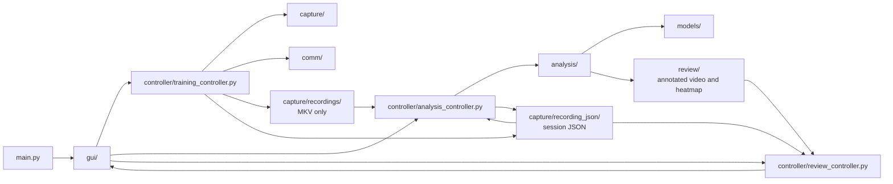

# Codebase Functionality Map

## Purpose

This document is a practical map of what each part of the Jetson codebase does.

Use it when you need to answer:

```text
Where does this behavior live?
Which file should I change?
Which files are active runtime code vs archived/reference code?
```

For the higher-level system design, see `software_architecture.md`.

---

## Top-Level Flow



---

## Entry Point

| File | What it does |
| --- | --- |
| `main.py` | Adds `gui/` to `sys.path` and launches `run_gui()`. It should stay small and should not contain workflow logic. |

---

## GUI Layer: `gui/`

The GUI layer is Tkinter-based. It should display controls and route user actions to controllers.

| File | What it does |
| --- | --- |
| `gui.py` | Main application shell. Creates the root window, registers pages, starts on the navigation page, and handles safe shutdown. |
| `gui_config.py` | Window size, page names, colors, fonts, polling intervals, and display settings. |
| `page_manager.py` | Registers pages and raises the selected page. |
| `navigation_page.py` | Start screen for choosing Training, Analysis, or Review. |
| `scrollable_frame.py` | Reusable touchscreen-friendly scrolling container used by long pages. |
| `training_page.py` | Session name, training controls, preview display, controller polling, and user-facing status. |
| `analysis_page.py` | Recording and model-version selection, analysis start, status/log display, and controller polling. |
| `review_page.py` | Session selection, JSON-backed metric display, and heatmap preview. |
| `review_page_old.py` | Preserved Review implementation from before session JSON integration. |
| `gui_backup.py`, `GUI_Coulter.py` | Older or backup GUI code. Treat as reference unless intentionally reviving it. |

Rule:

```text
GUI files should not directly run YOLO, manage GStreamer, or open serial devices.
```

---

## Controller Layer: `controller/`

Controllers connect GUI actions to functional modules.

| File | What it does |
| --- | --- |
| `training_controller.py` | Validates settings, manages training state, coordinates preview/recording/serial, and creates initial session JSON. |
| `training_controller_config.py` | Training limits, state names, serial/recording toggles, STM32 response keywords, and status messages. |
| `analysis_controller.py` | Lists recordings/model versions, reads prior analysis summaries, runs analysis in a thread, forwards structured progress, and merges results into session JSON. |
| `analysis_controller_config.py` | Recording folder, valid video extensions, thread toggle, and analysis status messages. |
| `review_controller.py` | Lists and loads `_session.json` files, extracts metrics, and resolves heatmap paths. |
| `review_controller_config.py` | Legacy/general Review output configuration; session discovery uses the recordings directory. |

Rule:

```text
Controllers coordinate workflows. They should not contain low-level CV algorithms or GUI widget construction.
```

---

## Capture Layer: `capture/`

Capture code owns camera access for preview and recording.

| File | What it does |
| --- | --- |
| `preview.py` | Threaded low-FPS OpenCV preview service. Stores the latest RGB frame for the GUI to poll. |
| `preview_config.py` | Preview camera index/path, preview size, FPS, frame timing, and direct-test output path. |
| `recording.py` | `MjpegRecorder` using GStreamer to record MJPG camera frames into MKV files. |
| `recording_config.py` | Camera device, recording size, recording FPS, output naming, queue settings, and stop timeout. |
| `calibration.py` | Calibration-related placeholder or support code. |
| `capture/recordings/` | Saved training recordings used as analysis inputs. |

Two camera paths are intentionally separate:

```text
Preview:
OpenCV -> low-FPS frame display

Recording:
GStreamer -> high-FPS MKV file -> offline analysis
```

---

## Analysis Layer: `analysis/`

Analysis code owns computer vision and output generation.

| File | What it does |
| --- | --- |
| `analysis.py` | Main analysis pipeline. Opens video, computes table homography, runs ball/bounce tracking, emits optional progress events, and creates review outputs. |
| `analysis_config.py` | Paths, model settings, thresholds, frame limits, table dimensions, heatmap settings, annotation settings, and JSON settings. |
| `model_selection.py` | Version discovery, validation, table/ball path resolution, and output-tag generation. |
| `video_checker.py` | Video existence/open/readability checks and metadata extraction. |
| `table.py` | Detects table corners and optional net posts, then stabilizes net positions for the launch boundary. |
| `homography.py` | Builds sample frame indices, validates table corners, computes stable homography, maps image points to table space. |
| `ball.py` | Loads the configured versioned ball/player model and runs tracker-compatible candidate, active-ball, challenger, and bounce state. |
| `bounce.py` | Adapts tracker-owned bounce points for output/reporting compatibility. |
| `annotate.py` | Draws candidates, challengers, active tracking, bounce diagnostics, existing table/frame overlays, and annotated videos. |
| `heatmap.py` | Maps bounce events into table coordinates and draws heatmap images/overlays. |
| `log_json.py` | Builds JSON-safe logs and loads, merges, and saves Training + Analysis session JSON. |
| `archived/` | Reference-only former implementations documented in `analysis/archived/README.md`. |

Current primary metrics:

```text
- Table corners
- Homography quality
- Active ball positions
- Ball tracking summary
- Bounce count
- Bounce event positions/times
- Heatmap output
```

Prepared but not fully surfaced:

```text
- Player-specific metrics
- Accepted/rejected bounce diagnostics
```

---

## Communication Layer: `comm/`

Communication code owns the Jetson-to-STM32 launcher protocol.

| File | What it does |
| --- | --- |
| `serial.py` | Builds `SETTINGS`, `START`, and `STOP` messages; opens/configures serial device; sends bytes; reads available responses. |
| `serial_config.py` | Serial baud rate, device discovery patterns, command names, delimiters, terminators, and field limits. |
| `serial_direct_test.py` | Terminal test utility for dry-run or real serial command testing. |

Protocol:

```text
SETTINGS:<ballspeed>:<rate_ms>:<number_of_shots>\n
START\n
STOP\n
```

Expected future incoming messages include:

```text
COMPLETE
ACK:SETTING
ACK:START
ACK:STOP
ERR:...
```

---

## Data Classes: `classes/`

| File | What it does |
| --- | --- |
| `objects.py` | Project object definitions used by analysis modules, including table/corner-style structures. |

This folder is small but important because table detection and homography share object shapes.

---

## Model Files: `models/`

Model versions are stored as complete sets:

```text
models/
├── v1/
│   ├── table_pose_01.pt
│   └── ball_player_detect_01.pt
└── v2/
    ├── table_pose_02.pt
    └── ball_player_detect_02.pt
```

`analysis/analysis_config.py` selects the active version. Both models currently
inherit `DEFAULT_MODEL_VERSION`. Separate `TABLE_MODEL_VERSION` and
`BALL_MODEL_VERSION` values allow independent selection later.

The Analysis page discovers complete folders and lets the user select one
version for the current run. The controller captures that selection before the
background thread starts, so changing a widget later cannot alter a running job.

Model paths are configured in:

```text
analysis/analysis_config.py
```

---

## Output Folders

| Folder | What it stores |
| --- | --- |
| `capture/recordings/` | Raw MKV recordings only. |
| `capture/recording_json/` | Training and analysis `_session.json` records. |
| `review/annotated/` | Annotated MKV videos created by analysis. |
| `review/heatmaps/` | Heatmap PNG images created by analysis. |
| `json_results/` | Older/parallel analysis-log output; it is not the current Review source. |

Intended output relationship:

```text
capture/recordings/session.mkv
capture/recording_json/session_session.json
review/annotated/annotate_session.mkv
review/heatmaps/heatmap_session.png
```

The session JSON is created by Training, enriched by Analysis, and read by
Review. This is the active information path.

---

## Archived Code

Archived folders and backup files contain older implementation attempts:

```text
archived/
analysis/archived/
gui/gui_backup.py
gui/GUI_Coulter.py
```

Treat these as reference material. The active architecture uses:

```text
main.py
gui/
controller/
capture/
analysis/
comm/
```

The former separate bounce detector is
`analysis/archived/bounce_separate_state.py`. It was replaced when bounce state
moved into `analysis/ball.py` to reproduce the original tracker update order.

---

## Where To Change Things

| Goal | Start Here |
| --- | --- |
| Change GUI layout or labels | `gui/*_page.py`, `gui/gui_config.py` |
| Change training setting limits | `controller/training_controller_config.py` |
| Change STM32 protocol | `comm/serial.py`, `comm/serial_config.py` |
| Change camera preview behavior | `capture/preview.py`, `capture/preview_config.py` |
| Change recording resolution/FPS | `capture/recording_config.py` |
| Select model versions or change thresholds | `analysis/analysis_config.py` |
| Change table detection behavior | `analysis/table.py` |
| Change homography behavior | `analysis/homography.py` |
| Change ball tracking behavior | `analysis/ball.py` |
| Change bounce detection thresholds or tracker order | `analysis/analysis_config.py`, `analysis/ball.py` |
| Find the replaced separate bounce algorithm | `analysis/archived/README.md`, `analysis/archived/bounce_separate_state.py` |
| Change heatmap appearance | `analysis/heatmap.py`, `analysis/analysis_config.py` |
| Change session JSON structure or merge | `controller/training_controller.py`, `analysis/log_json.py`, `controller/analysis_controller.py` |
| Change Review session loading | `controller/review_controller.py`, `gui/review_page.py` |

---

## Development Rule of Thumb

```text
If it touches widgets, it belongs in gui/.
If it coordinates a workflow, it belongs in controller/.
If it touches hardware or files directly, it belongs in capture/ or comm/.
If it computes vision results, it belongs in analysis/.
If it displays saved outputs, it belongs in review GUI/controller code.
```
