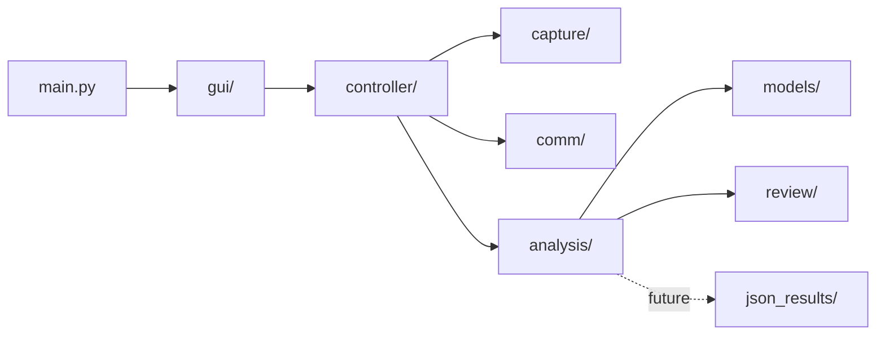

# Codebase Functionality Map

## Purpose

This document is a practical map of what each part of the Jetson codebase does.

Use it when you need to answer:

```text
Where does this behavior live?
Which file should I change?
Which files are active runtime code vs archived/reference code?
```

For the higher-level system design, see `software_architecture.md`.

---

## Top-Level Flow



---

## Entry Point

| File | What it does |
| --- | --- |
| `main.py` | Adds `gui/` to `sys.path` and launches `run_gui()`. It should stay small and should not contain workflow logic. |

---

## GUI Layer: `gui/`

The GUI layer is Tkinter-based. It should display controls and route user actions to controllers.

| File | What it does |
| --- | --- |
| `gui.py` | Main application shell. Creates the root window, registers pages, starts on the navigation page, and handles safe shutdown. |
| `gui_config.py` | Window size, page names, colors, fonts, polling intervals, and display settings. |
| `page_manager.py` | Registers pages and raises the selected page. |
| `navigation_page.py` | Start screen for choosing Training, Analysis, or Review. |
| `training_page.py` | Training controls, preview display, controller polling, and user-facing training status. |
| `analysis_page.py` | Recording selection, analysis start button, status/log display, and controller polling. |
| `review_page.py` | Heatmap selection and preview UI. |
| `gui_backup.py`, `GUI_Coulter.py` | Older or backup GUI code. Treat as reference unless intentionally reviving it. |

Rule:

```text
GUI files should not directly run YOLO, manage GStreamer, or open serial devices.
```

---

## Controller Layer: `controller/`

Controllers connect GUI actions to functional modules.

| File | What it does |
| --- | --- |
| `training_controller.py` | Validates training settings, manages training state, starts/stops preview, starts/stops recording, sends STM32 commands, and handles future STM32 responses. |
| `training_controller_config.py` | Training limits, state names, serial/recording toggles, STM32 response keywords, and status messages. |
| `analysis_controller.py` | Lists recordings, dynamically loads `analysis/analysis.py`, starts analysis in a background thread, and queues status/result messages. |
| `analysis_controller_config.py` | Recording folder, valid video extensions, thread toggle, and analysis status messages. |
| `review_controller.py` | Lists heatmap files and contains optional system-viewer support for review artifacts. |
| `review_controller_config.py` | Review output folders and valid image extensions. |

Rule:

```text
Controllers coordinate workflows. They should not contain low-level CV algorithms or GUI widget construction.
```

---

## Capture Layer: `capture/`

Capture code owns camera access for preview and recording.

| File | What it does |
| --- | --- |
| `preview.py` | Threaded low-FPS OpenCV preview service. Stores the latest RGB frame for the GUI to poll. |
| `preview_config.py` | Preview camera index/path, preview size, FPS, frame timing, and direct-test output path. |
| `recording.py` | `MjpegRecorder` using GStreamer to record MJPG camera frames into MKV files. |
| `recording_config.py` | Camera device, recording size, recording FPS, output naming, queue settings, and stop timeout. |
| `calibration.py` | Calibration-related placeholder or support code. |
| `capture/recordings/` | Saved training recordings used as analysis inputs. |

Two camera paths are intentionally separate:

```text
Preview:
OpenCV -> low-FPS frame display

Recording:
GStreamer -> high-FPS MKV file -> offline analysis
```

---

## Analysis Layer: `analysis/`

Analysis code owns computer vision and output generation.

| File | What it does |
| --- | --- |
| `analysis.py` | Main analysis pipeline. Opens video, computes table homography, runs ball/bounce tracking, and creates review outputs. |
| `analysis_config.py` | Paths, model settings, thresholds, frame limits, table dimensions, heatmap settings, annotation settings, and JSON settings. |
| `video_checker.py` | Video existence/open/readability checks and metadata extraction. |
| `table.py` | Loads `table_keypoints.pt`, detects table keypoints, and builds table objects. |
| `homography.py` | Builds sample frame indices, validates table corners, computes stable homography, maps image points to table space. |
| `ball.py` | Loads `ball_player_detect.pt`, detects ball candidates, tracks the active ball, and stores recent positions/trails. |
| `bounce.py` | Detects bounce events from active-ball vertical motion and cooldown logic. |
| `annotate.py` | Draws analysis overlays and writes annotated videos. |
| `heatmap.py` | Maps bounce events into table coordinates and draws heatmap images/overlays. |
| `log_json.py` | Builds JSON-safe analysis logs for future structured export. |
| `archived/` | Older analysis implementations kept for reference. |

Current primary metrics:

```text
- Table corners
- Homography quality
- Active ball positions
- Ball tracking summary
- Bounce count
- Bounce event positions/times
- Heatmap output
```

Prepared but not fully surfaced:

```text
- Rich JSON metrics export
- Player-specific metrics
- Accepted/rejected bounce diagnostics
```

---

## Communication Layer: `comm/`

Communication code owns the Jetson-to-STM32 launcher protocol.

| File | What it does |
| --- | --- |
| `serial.py` | Builds `SETTINGS`, `START`, and `STOP` messages; opens/configures serial device; sends bytes; reads available responses. |
| `serial_config.py` | Serial baud rate, device discovery patterns, command names, delimiters, terminators, and field limits. |
| `serial_direct_test.py` | Terminal test utility for dry-run or real serial command testing. |

Protocol:

```text
SETTINGS:<ballspeed>:<rate_ms>:<number_of_shots>\n
START\n
STOP\n
```

Expected future incoming messages include:

```text
COMPLETE
ACK:SETTING
ACK:START
ACK:STOP
ERR:...
```

---

## Data Classes: `classes/`

| File | What it does |
| --- | --- |
| `objects.py` | Project object definitions used by analysis modules, including table/corner-style structures. |

This folder is small but important because table detection and homography share object shapes.

---

## Model Files: `models/`

| File | What it does |
| --- | --- |
| `table_keypoints.pt` | YOLO keypoint model for table corners and optional net points. |
| `ball_player_detect.pt` | YOLO object model for ball and player detections. |

Model paths are configured in:

```text
analysis/analysis_config.py
```

---

## Output Folders

| Folder | What it stores |
| --- | --- |
| `capture/recordings/` | Raw recorded MKV training sessions. |
| `review/annotated/` | Annotated MKV videos created by analysis. |
| `review/heatmaps/` | Heatmap PNG images created by analysis. |
| `json_results/` | Future or partially integrated structured JSON results. |

Intended output relationship:

```text
capture/recordings/session.mkv
review/annotated/annotate_session.mkv
review/heatmaps/heatmap_session.png
json_results/session_analysis.json
```

---

## Archived Code

Archived folders and backup files contain older implementation attempts:

```text
archived/
analysis/archived/
gui/gui_backup.py
gui/GUI_Coulter.py
```

Treat these as reference material. The active architecture uses:

```text
main.py
gui/
controller/
capture/
analysis/
comm/
```

---

## Where To Change Things

| Goal | Start Here |
| --- | --- |
| Change GUI layout or labels | `gui/*_page.py`, `gui/gui_config.py` |
| Change training setting limits | `controller/training_controller_config.py` |
| Change STM32 protocol | `comm/serial.py`, `comm/serial_config.py` |
| Change camera preview behavior | `capture/preview.py`, `capture/preview_config.py` |
| Change recording resolution/FPS | `capture/recording_config.py` |
| Change YOLO model paths or thresholds | `analysis/analysis_config.py` |
| Change table detection behavior | `analysis/table.py` |
| Change homography behavior | `analysis/homography.py` |
| Change ball tracking behavior | `analysis/ball.py` |
| Change bounce detection thresholds | `analysis/analysis_config.py`, `analysis/bounce.py` |
| Change heatmap appearance | `analysis/heatmap.py`, `analysis/analysis_config.py` |
| Change review artifact loading | `controller/review_controller.py`, `gui/review_page.py` |

---

## Development Rule of Thumb

```text
If it touches widgets, it belongs in gui/.
If it coordinates a workflow, it belongs in controller/.
If it touches hardware or files directly, it belongs in capture/ or comm/.
If it computes vision results, it belongs in analysis/.
If it displays saved outputs, it belongs in review GUI/controller code.
```
