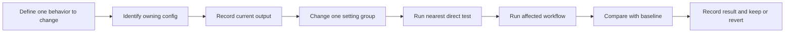

# Configuration Reference

## Purpose

This document explains the active configuration files, what their important
settings control, and how to change them safely.

Configuration values are not all equally safe:

| Category | Meaning |
| --- | --- |
| User-facing limit | Controls allowed Training inputs. Usually safe to change with validation tests. |
| Algorithm tuning | Changes computer-vision behavior. Change against labeled recordings. |
| Hardware | Changes camera or STM32 access. Test on the Jetson. |
| Output | Changes filenames, codecs, or artifact generation. Verify downstream Review behavior. |
| Test/debug | Changes logs or direct-test behavior. Should not alter production results. |
| Legacy | Present for compatibility or older designs; do not use as the current source of truth. |

---

## Configuration Ownership

```mermaid
flowchart TD
    GUI[gui/gui_config.py] --> Display[Window, colors, text, and polling]
    Training[controller/training_controller_config.py] --> Workflow[Training validation, state, and hardware toggles]
    Preview[capture/preview_config.py] --> PreviewPath[Low-FPS preview]
    Recording[capture/recording_config.py] --> RecordingPath[High-FPS GStreamer recording]
    Serial[comm/serial_config.py] --> Protocol[STM32 device and protocol]
    Analysis[analysis/analysis_config.py] --> CV[Models, tracking, bounce, homography, and outputs]
    AnalysisController[controller/analysis_controller_config.py] --> AnalysisUI[Analysis file selection and threading]
    Review[controller/review_controller_config.py] --> ReviewPaths[Review artifact folders]
```



Key rule:

```text
Change a setting in the module that owns the behavior.
```

For example, change recording FPS in `capture/recording_config.py`, not in the
GUI or analysis controller.

---

## Analysis Configuration

File: `analysis/analysis_config.py`

### Camera calibration

| Setting | Default | Meaning |
| --- | --- | --- |
| `CAMERA_CALIBRATION_ENABLED` | `True` | Correct table, bounce, and speed points using the fisheye profile. |
| `CAMERA_CALIBRATION_REQUIRED` | `True` | Fail analysis if the profile is missing, malformed, or resolution-mismatched. |
| `CAMERA_CALIBRATION_PROFILE_PATH` | `capture/calibration_data/fisheye_1280x720.json` | Profile created by the Calibration GUI. |

Keep correction required for production measurements. Disabling it is useful
only for controlled before/after comparisons because a raw point cannot be
passed through a homography built from corrected corners.

### Model selection

| Setting | Default | Meaning | Safe change procedure |
| --- | --- | --- | --- |
| `DEFAULT_MODEL_VERSION` | `"v2"` | Default folder shown by the Analysis page. | Confirm the folder contains both expected weights. |
| `TABLE_MODEL_VERSION` | Default version | Table model used outside a GUI override. | Run model-path and table-loading tests. |
| `BALL_MODEL_VERSION` | Default version | Ball/player model used outside a GUI override. | Run model-path and ball-loading tests. |
| `TABLE_MODEL_IMGSZ` | `640` | YOLO table inference image size in pixels. | Measure speed and keypoint accuracy. |
| `TABLE_MODEL_CONFIDENCE` | `0.25` | Minimum table detection confidence. | Compare valid and rejected table frames. |
| `BALL_MODEL_IMGSZ` | `640` | YOLO ball/player inference image size. | Measure frame time and ball recall. |
| `BALL_MODEL_CONFIDENCE` | `0.25` | Minimum ball/player confidence. | Evaluate false candidates and missed balls. |
| `BALL_CLASS_ID` | `0` | YOLO class ID treated as ball. | Confirm against `model.names`. |
| `PLAYER_CLASS_ID` | `1` | YOLO class ID treated as player. | Confirm against `model.names`. |

Model folders follow this contract:

```text
models/v1/table_pose_01.pt
models/v1/ball_player_detect_01.pt
models/v2/table_pose_02.pt
models/v2/ball_player_detect_02.pt
```

`analysis/model_selection.py` discovers complete folders. An incomplete version
is not shown in the Analysis dropdown.

### Table detection and homography

| Setting | Default | Unit | Effect |
| --- | --- | --- | --- |
| `TABLE_REQUIRED_KEYPOINT_COUNT` | `4` | keypoints | Minimum corners required for homography. |
| `TABLE_DETECTION_MAX_FRAMES` | `60` | frames | Maximum early frames inspected by direct table collection. |
| `TABLE_DETECTION_FRAME_STEP` | `10` | frames | Gap between inspected frames. Higher is faster but samples less. |
| `TABLE_DETECTION_MIN_SUCCESSFUL_FRAMES` | `1` | detections | Minimum successful detections for the table helper. |
| `TABLE_LENGTH_MM` | `2740.0` | mm | Physical table length. Do not tune as a threshold. |
| `TABLE_WIDTH_MM` | `1525.0` | mm | Physical table width. Do not tune as a threshold. |
| `HOMOGRAPHY_OUTPUT_WIDTH` | `1200` | pixels | Width of the normalized top-down table. |
| `HOMOGRAPHY_SAMPLE_COUNT` | `15` | frames | Number of table samples requested. |
| `HOMOGRAPHY_SAMPLE_START_SECONDS` | `5.0` | seconds | Start of the table-sampling window. |
| `HOMOGRAPHY_SAMPLE_END_SECONDS` | `10.0` | seconds | End of the table-sampling window. |
| `HOMOGRAPHY_MIN_VALID_DETECTIONS` | `5` | detections | Minimum samples used for stable homography. |
| `HOMOGRAPHY_MAX_MEAN_CORNER_ERROR_PX` | `30.0` | pixels | Stability warning threshold after corner aggregation. |
| `HOMOGRAPHY_MAX_CORNER_ERROR_PX` | `80.0` | pixels | Per-sample outlier rejection threshold. |
| `HOMOGRAPHY_MIN_TABLE_AREA_PX` | `1000.0` | pixel area | Rejects tiny or collapsed table polygons. |
| `HOMOGRAPHY_REJECT_OUTLIERS` | `True` | boolean | Enables sampled-corner outlier rejection. |

Key tuning decision:

```text
Increase sampling for stability only if the camera and table stay fixed.
Do not hide poor table detections by making outlier limits extremely large.
```

### Ball analysis and tracking

| Setting | Default | Unit | Increase when | Decrease when |
| --- | --- | --- | --- | --- |
| `BALL_TRACKING_HISTORY_SIZE` | `12` | positions | More recent motion history is needed. | Memory/debug output should be smaller. |
| `BALL_ANALYSIS_MAX_FRAMES` | `None` | frames | Use an integer only for limited testing. | Not applicable; `None` processes the whole video. |
| `BALL_ANALYSIS_PROGRESS_INTERVAL` | `120` | frames | Terminal output is too noisy. | More frequent progress is useful. |
| `BALL_MIN_MOTION_THRESHOLD` | `5.0` | pixels | Stationary false candidates are selected. | Slow real balls are ignored. |
| `BALL_MATCH_DISTANCE_THRESHOLD` | `120.0` | pixels | Fast motion breaks continuation matching. | The tracker jumps to unrelated candidates. |
| `BALL_MAX_MISSES` | `4` | updates | Short detection gaps drop the track. | Wrong tracks persist too long. |
| `BALL_SWITCH_CONFIRM_FRAMES` | `3` | frames | False challenger switches occur. | A new real ball takes too long to replace the track. |
| `BALL_CHALLENGER_SAME_RADIUS` | `60.0` | pixels | One challenger is split into multiple candidates. | Nearby unrelated candidates are treated as one. |
| `BALL_MAX_TRAIL_POINTS` | `40` | points | A longer visual trail is needed. | The overlay is cluttered. |

Estimated return-speed filtering:

| Setting | Default | Meaning |
| --- | --- | --- |
| `SPEED_POSITION_WINDOW` | `8` | Maximum recent positions considered before a bounce. |
| `SPEED_MIN_SEGMENT_SAMPLES` | `2` | Minimum valid motion segments required for one estimate. |
| `SPEED_MAX_FRAME_GAP` | `3` | Largest accepted gap between consecutive tracked positions. |
| `SPEED_MIN_KMH` | `1.0` | Reject lower stationary/noise estimates. |
| `SPEED_MAX_KMH` | `200.0` | Reject physically implausible tracker jumps. |
| `SPEED_OUTLIER_MAD_MULTIPLIER` | `3.0` | Robust segment-speed outlier threshold. |

These settings produce a monocular two-dimensional table-plane estimate, not a
full 3D speed measurement.

Launch-region fractions use frame width/height values from `0.0` to `1.0`:

| Setting | Default | Meaning |
| --- | --- | --- |
| `BALL_LAUNCH_X_MIN_FRAC` | `0.25` | Left launch-region boundary. |
| `BALL_LAUNCH_X_MAX_FRAC` | `0.75` | Right launch-region boundary. |
| `BALL_LAUNCH_Y_MAX_FRAC` | `0.45` | Fallback bottom boundary when valid table net posts are unavailable. |
| `BALL_INIT_REQUIRE_LAUNCH_REGION` | `False` | Matches tracker.py: launch candidates receive a bonus but are not required. |

Initial and challenger weights combine motion, confidence, and launch-region
preference. Change one weight group at a time and compare track switches/drops.

At runtime, table-pose keypoints 4 and 5 are stabilized across accepted table
detections. Their average `y` coordinate becomes the launch rectangle's bottom
edge, so its height is the video area from `y=0` down to the detected net posts.
The same rectangle is used by tracking and annotation. If neither post is
valid, the pipeline falls back to `BALL_LAUNCH_Y_MAX_FRAC`.

### Bounce detection

| Setting | Default | Unit | Meaning |
| --- | --- | --- | --- |
| `BOUNCE_VY_DOWN_THRESHOLD` | `20.0` | pixels/second | Tuned below tracker.py's original 120 px/s value to arm on shallower descents. |
| `BOUNCE_VY_UP_THRESHOLD` | `20.0` | pixels/second | Tuned below tracker.py's original 120 px/s value to confirm shallower upward reversals. |
| `BOUNCE_COOLDOWN_FRAMES` | `6` | processed frames | Prevents one contact from being counted repeatedly. |
| `BOUNCE_MIN_TRACK_UPDATES` | `3` | updates | Minimum active-track age before trusting motion. |
| `BOUNCE_HISTORY_FRAMES` | `9` | positions | Rolling temporal window used for shallow reversals. |
| `BOUNCE_INCOMING_MIN_POINTS` / `MAX_POINTS` | `3` / `4` | positions | Range used to fit the incoming slope. |
| `BOUNCE_OUTGOING_MIN_POINTS` / `MAX_POINTS` | `2` / `3` | positions | Range used to fit the outgoing slope. |
| `BOUNCE_CONTACT_PLATEAU_TOLERANCE_PX` | `0.05` | pixels | Groups effectively equal contact-height samples. |
| `BOUNCE_USE_BBOX_BOTTOM` | `True` | boolean | Uses bbox-bottom motion instead of center motion for bounce fitting. |
| `BOUNCE_IGNORE_LAUNCH_REGION` | `True` | boolean | Documented compatibility setting; tracker behavior always ignores the launch region. |

Do not tune bounce thresholds from one apparent failure. First use the
diagnostic plan in [Bounce Detection Improvement Plan](bounce_detection_improvement_plan.md).
The current algorithm fits short incoming and outgoing temporal slopes. It
preserves floating-point detector coordinates so shallow subpixel motion is not
quantized away before fitting.

### Heatmap output

| Setting | Default | Meaning |
| --- | --- | --- |
| `HEATMAP_ENABLED` | `True` | Master heatmap toggle. |
| `HEATMAP_SAVE_IMAGE` | `True` | Saves a standalone PNG. |
| `HEATMAP_DRAW_ON_ANNOTATED_VIDEO` | `True` | Draws the mini heatmap overlay. |
| `HEATMAP_OUTPUT_DIR` | `review/heatmaps` | Heatmap storage location. |
| `HEATMAP_OVERLAY_HEIGHT` | `520` | Overlay height in pixels. |
| `HEATMAP_OVERLAY_MARGIN` | `20` | Frame-edge margin in pixels. |
| `HEATMAP_OVERLAY_ALPHA` | `0.92` | Overlay opacity from `0.0` to `1.0`. |
| `HEATMAP_OVERLAY_DRAW_DENSITY` | `True` | Draws bounce-density shading. |
| `HEATMAP_OVERLAY_DRAW_LABELS` | `True` | Draws labels on the mini table. |

### Annotation output

| Setting | Default | Meaning |
| --- | --- | --- |
| `ANNOTATION_ENABLED` | `True` | Master annotation toggle. |
| `ANNOTATION_SAVE_VIDEO` | `True` | Writes an annotated MKV. |
| `ANNOTATION_SHOW_PREVIEW` | `False` | Live OpenCV preview; intentionally disabled for offline workflow. |
| `ANNOTATED_VIDEO_DIR` | `review/annotated` | Annotated output folder. |
| `ANNOTATED_VIDEO_PREFIX` | `annotate_` | Filename prefix. |
| `ANNOTATED_VIDEO_EXTENSION` | `.mkv` | Container extension. |
| `ANNOTATED_VIDEO_CODEC` | `MJPG` | OpenCV writer codec. |
| `ANNOTATION_DRAW_*` | mixed | Enables individual table, ball, trail, bounce, and debug overlays. |

Annotated filenames also include the selected model tag, such as `_v2`.

---

## Training Controller Configuration

File: `controller/training_controller_config.py`

### User-input limits

| Setting group | Current range/default | Unit |
| --- | --- | --- |
| Ball speed | `55–100`, default `75` | launcher value |
| Pace | `0.1–60.0`, default `1.5` | seconds in GUI |
| Start delay | `0–15`, default `0`, increment `0.5` | seconds before full training |
| Number of shots | `1–999`, default `10` | balls |

The controller converts pace seconds to milliseconds before sending `SETTINGS`.
Start delay is temporary controller state and is not sent to the STM32 or saved
in the session JSON.

### Hardware toggles

| Setting | Default | Warning |
| --- | --- | --- |
| `ENABLE_REAL_RECORDING` | `True` | Starts the real camera recorder. |
| `ENABLE_REAL_STM32_SERIAL` | `True` | Can send real launcher commands. |
| `STM32_SERIAL_DEVICE_PATH` | `None` | `None` delegates device selection to serial configuration. |
| `STM32_SERIAL_BAUD_RATE` | `None` | `None` delegates baud rate to serial configuration. |
| `RUN_FULL_TRAINING_DIRECT_TEST` | `False` | Enabling may operate real hardware. |

`USE_PLACEHOLDER_HARDWARE` remains in the configuration as a legacy incremental-
development flag, but the active controller paths use the explicit
`ENABLE_REAL_RECORDING` and `ENABLE_REAL_STM32_SERIAL` toggles. Do not treat it
as the master hardware switch.

### State names and status strings

State/status constants are controller-to-GUI contracts. Renaming them may break
comparisons or user messages; treat them as code changes, not ordinary tuning.

---

## Preview Configuration

File: `capture/preview_config.py`

| Setting | Default | Unit | Meaning |
| --- | --- | --- | --- |
| `CAMERA_DEVICE_INDEX` | `0` | index | OpenCV camera index. |
| `CAMERA_DEVICE_PATH` | `/dev/video0` | path | Expected physical device. |
| `PREVIEW_WIDTH` | `640` | pixels | Requested preview width. |
| `PREVIEW_HEIGHT` | `360` | pixels | Requested preview height. |
| `PREVIEW_FPS` | `10` | FPS | Low-FPS setup preview rate. |
| `PREVIEW_FOURCC` | `MJPG` | codec | Requested camera format. |
| `FRAME_READ_SLEEP_SECONDS` | `0.005` | seconds | Preview-thread pacing. |
| `FRAME_READ_RETRY_SLEEP_SECONDS` | `0.05` | seconds | Delay after failed frame read. |

Preview is deliberately lower-cost than recording. Matching preview FPS to the
60 FPS recording is not required and can waste resources.

---

## Recording Configuration

File: `capture/recording_config.py`

| Setting | Default | Unit | Meaning |
| --- | --- | --- | --- |
| `CAMERA_DEVICE` | `/dev/video0` | path | V4L2/GStreamer camera device. |
| `RECORDING_WIDTH` | `1280` | pixels | Recorded width. |
| `RECORDING_HEIGHT` | `720` | pixels | Recorded height. |
| `RECORDING_FPS` | `60` | FPS | Recorded frame rate. |
| `RECORDING_OUTPUT_PREFIX` | `gameplay` | text | Recording filename prefix. |
| `USE_TIMESTAMPED_RECORDING_NAME` | `True` | boolean | Creates unique recording filenames. |
| `GST_QUEUE_BUFFER_COUNT` | `120` | buffers | Approximately two seconds at 60 FPS. |
| `GST_QUEUE_LEAK_MODE` | `no` | GStreamer mode | Determines whether queued frames may be discarded. |
| `RECORDING_STOP_TIMEOUT_SECONDS` | `10` | seconds | Time allowed for clean finalization. |

The `BALL_MODEL_PATH`, `TABLE_MODEL_PATH`, `PLAYER_MODEL_PATH`, and `LATEST_*`
constants in this file belong to an older combined recording/analysis design.
Active model selection is owned by `analysis/analysis_config.py` and
`analysis/model_selection.py`.

---

## Serial Configuration

File: `comm/serial_config.py`

| Setting | Default | Meaning |
| --- | --- | --- |
| `DEFAULT_SERIAL_DEVICE` | `/dev/ttyACM0` | Normal STM32 USB serial path. |
| `BACKUP_SERIAL_DEVICE` | `/dev/ttyUSB0` | USB-to-UART fallback. |
| `AUTO_DETECT_SERIAL_DEVICE` | `True` | Searches configured glob patterns. |
| `BAUD_RATE` | `9600` | Must match STM32 firmware. |
| `READ_TIMEOUT_SECONDS` | `0.5` | Read timeout for response handling. |
| `MESSAGE_ENCODING` | `utf-8` | Message encoding. |
| `MESSAGE_TERMINATOR` | newline | Marks the end of one command. |
| `FIELD_DELIMITER` | `:` | Separates command fields. |
| `DRY_RUN_BY_DEFAULT` | `True` | Default behavior of the serial direct-test utility. |

Protocol examples:

```text
SETTINGS:75:1500:10\n
START\n
STOP\n
```

Changing delimiter, command names, baud rate, or terminator requires a matching
STM32 firmware change.

---

## Analysis Controller Configuration

File: `controller/analysis_controller_config.py`

| Setting | Default | Meaning |
| --- | --- | --- |
| `RECORDINGS_DIR` | `capture/recordings` | Folder scanned by Analysis. |
| `VALID_RECORDING_EXTENSIONS` | configured list | File extensions accepted by the dropdown. |
| `RUN_ANALYSIS_IN_BACKGROUND_THREAD` | `True` | Keeps Tkinter responsive. Keep enabled for GUI use. |
| `RUN_FULL_ANALYSIS_DURING_DIRECT_TEST` | `False` | Prevents import-only tests from running expensive analysis. |

---

## Review Configuration

File: `controller/review_controller_config.py`

This file still defines general Review and legacy heatmap/annotated paths.
Current session discovery scans `capture/recording_json/` for `_session.json` files
through `controller/review_controller.py`.

The shared `RECORDING_JSON_DIR` and video-stem filename rule are defined in
`capture/session_paths.py`, then used by Training, Analysis, and Review.

---

## GUI Configuration

File: `gui/gui_config.py`

Important functional settings:

| Setting | Default | Meaning |
| --- | --- | --- |
| `WINDOW_WIDTH` / `WINDOW_HEIGHT` | `1024 × 768` | Target touchscreen size. |
| `WINDOW_RESIZABLE` | `False` | Fixed kiosk-style layout. |
| `PREVIEW_FRAME_POLL_INTERVAL_MS` | `100` | GUI preview polling interval. |
| `ANALYSIS_MESSAGE_POLL_INTERVAL_MS` | `100` | Analysis queue polling interval. |
| `PREVIEW_DISPLAY_MAX_WIDTH/HEIGHT` | `640 × 360` | Maximum displayed preview size. |

Colors, fonts, text labels, padding, and button dimensions are presentation
settings. Keep repeated styles in this file instead of hard-coding them in page
classes.

---

## Safe Configuration Change Workflow



For algorithm thresholds, use the same recordings before and after the change.
For hardware settings, verify the device supports the requested mode before
changing the application configuration.
