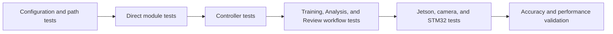
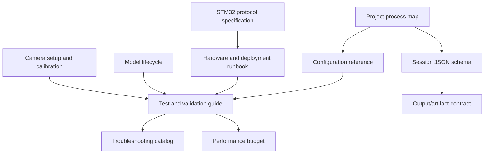

# Documentation Roadmap

## Purpose

This document lists additional parts of T-Cubed that would benefit from durable
documentation. It separates user workflow, developer reference, hardware,
testing, data, and operations so documentation can be added in useful
checkpoints.

The existing starting points are:

- [Software Architecture](software_architecture.md)
- [Project Process Map](project_process_map.md)
- [Codebase Functionality Map](codebase_functionality.md)
- [Training Workflow](training_workflow.md)
- [Analysis Pipeline](analysis_pipeline.md)
- [Review Workflow](review_workflow.md)
- [Bounce Detection Improvement Plan](bounce_detection_improvement_plan.md)
- [Configuration Reference](configuration_reference.md)
- [Session JSON Schema](session_json_schema.md)

---

## Recommended Documentation Backlog

| Priority | Document | Questions it should answer |
| --- | --- | --- |
| Complete | Configuration reference | Which settings are safe to tune, what units do they use, and what behavior changes? |
| Complete | Session JSON schema | Which component writes each field, which fields are optional, and how does the schema evolve? |
| High | Jetson deployment/runbook | How is the application started, which dependencies/devices are required, and how are failures diagnosed? |
| High | Test and validation guide | Which direct tests exist, where must they run, and what counts as passing? |
| High | STM32 protocol specification | What messages, fields, acknowledgements, timeouts, and failure cases exist? |
| Medium | Model lifecycle and evaluation | How are versions trained, named, selected, compared, and promoted? |
| Medium | Camera setup and calibration | What placement, resolution, FPS, exposure, focus, and table visibility are required? |
| Medium | Performance budget | Which stages use CPU, GPU, memory, storage, and time per frame? |
| Medium | GUI state and navigation | Which controls are enabled in each state and what prevents unsafe navigation? |
| Medium | Output/artifact contract | How are MKV, heatmap, annotated video, and JSON names related? |
| Later | Troubleshooting catalog | What do common camera, serial, model, video, and JSON errors mean? |
| Later | Dataset and labeling guide | How are table, ball, player, and bounce labels produced and checked? |
| Later | Release/change log | Which features and schema changes belong to each project week or release? |

---

## 1. Configuration Reference

Document every setting by subsystem:

```text
setting name
default value
unit
allowed range
owner module
effect of increasing it
effect of decreasing it
safe test procedure
```

Important groups:

- Preview and recording resolution/FPS
- Serial device and protocol settings
- Model version, confidence, and image size
- Homography sampling and outlier thresholds
- Ball tracking and challenger thresholds
- Bounce thresholds and cooldown
- Annotation and heatmap toggles
- GUI polling intervals

This would reduce trial-and-error changes in `*_config.py` files.

---

## 2. Session JSON Schema

Create a field-by-field reference covering:

- Required versus optional fields
- Training-owned fields
- Analysis-owned fields
- Review-consumed fields
- Model-version metadata
- Artifact paths
- Quality flags
- Schema version and migration rules

Include a complete example session and a lifecycle diagram.

---

## 3. Hardware and Deployment Runbook

Document:

- Jetson model and operating-system assumptions
- Docker/container workflow, if required
- USB camera device discovery
- Supported camera modes
- STM32 serial-device discovery and permissions
- GPU/Torch/Ultralytics verification
- Required folders and writable output locations
- Startup and shutdown commands
- Recovery after camera, GStreamer, or serial failure

This should be usable by someone setting up a replacement Jetson.

---

## 4. Test and Validation Guide

Organize tests into levels:



For each test, document:

- Command
- Environment
- Required input
- Expected output
- Common failure meaning
- Whether it changes files or hardware state

---

## 5. STM32 Protocol Specification

Document outgoing commands and incoming responses as a stateful protocol, not
only as strings.

Include:

- `SETTINGS`, `START`, and `STOP` formats
- Units and allowed ranges
- `ACK`, `COMPLETE`, and `ERR` formats
- Required ordering
- Timeout and retry behavior
- Manual stop versus natural completion
- Examples of valid and invalid sessions
- Serial-device configuration

---

## 6. Model Lifecycle

Document how a model moves from training to production:

```text
dataset version
training run
weight file
version folder
direct loading test
validation recordings
accuracy comparison
promotion to default version
rollback procedure
```

Include class IDs, keypoint order, training metrics, known weaknesses, and the
recordings used to compare v1 against v2.

---

## 7. Camera Setup and Calibration

Document a repeatable physical setup:

- Camera mounting location and angle
- Required full-table visibility
- Focus and exposure recommendations
- Resolution and frame-rate tradeoffs
- Lighting expectations
- Motion-blur checks
- Table keypoint visibility
- Near/far perspective implications
- A visual pre-training checklist

This is particularly important for consistent bounce detection.

---

## 8. Performance and Resource Budget

Measure and document:

- Table-model inference time
- Ball-model inference time per frame
- Total analysis time per video minute
- GPU and system memory usage
- Annotated-video write rate
- Disk space per recording and output
- Model-switch cleanup behavior
- Temperature and throttling behavior on Jetson

This helps distinguish algorithm problems from hardware-capacity problems.

---

## 9. Troubleshooting Catalog

Organize common errors by symptom:

```text
Camera cannot open
Preview works but recording fails
Recording exists but cannot be decoded
Serial device not found
STM32 does not acknowledge command
Model folder missing or incomplete
CUDA/Torch/Ultralytics import failure
Table not detected
Ball track switches incorrectly
Real bounce missed
False bounce registered
Session JSON not found
Heatmap path missing
Review shows no sessions
```

Each entry should include likely causes, safe diagnostic commands, and the
smallest recovery action.

---

## Suggested Documentation Order



Recommended next documents:

1. Test and validation guide
2. Hardware/deployment runbook
3. STM32 protocol specification
4. Model lifecycle and evaluation
5. Camera setup and calibration
