# Project Process Map

## Purpose

This document maps the T-Cubed application from the top-level Selection screen
down to granular processing such as model loading, active-ball tracking, bounce
detection, annotation, heatmap generation, and session JSON updates.

The diagrams use progressive detail. Start at Level 0 and follow the relevant
workflow into the lower-level diagrams.

---

## Level 0: Application and Selection Screen

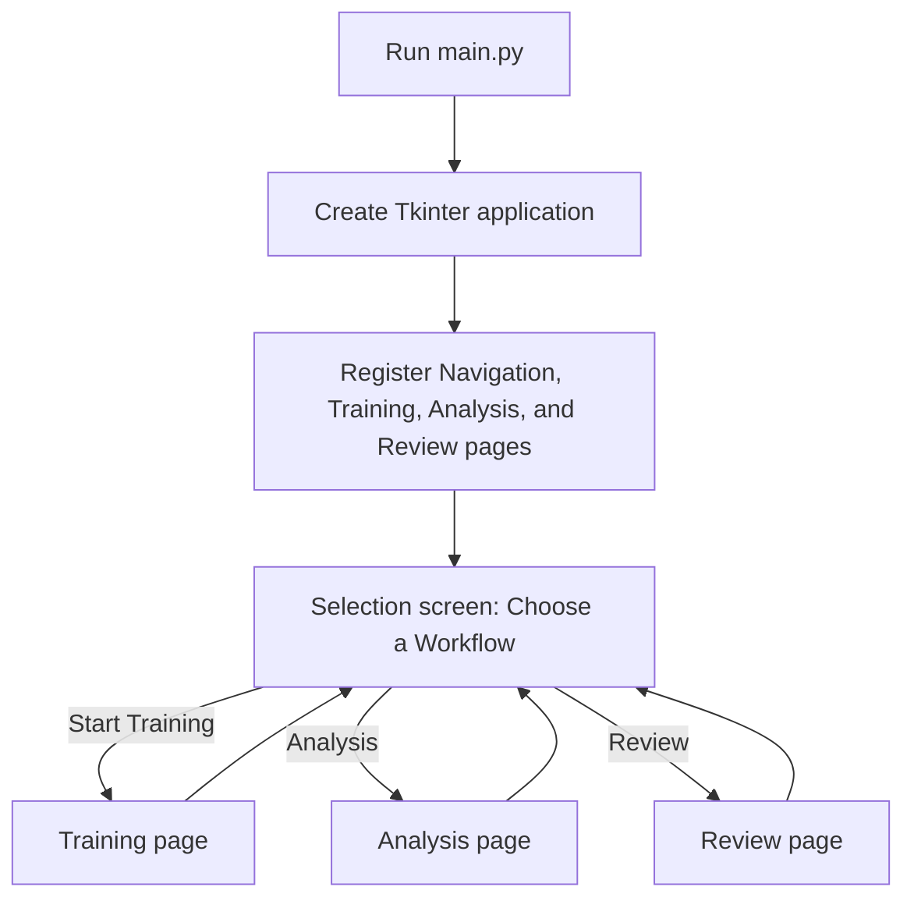

`main.py` only launches the GUI. `gui/gui.py` constructs the application and
registers all pages. `gui/navigation_page.py` owns the Selection screen but does
not run any training, analysis, or review logic.

---

## Level 1: Complete Project Workflow

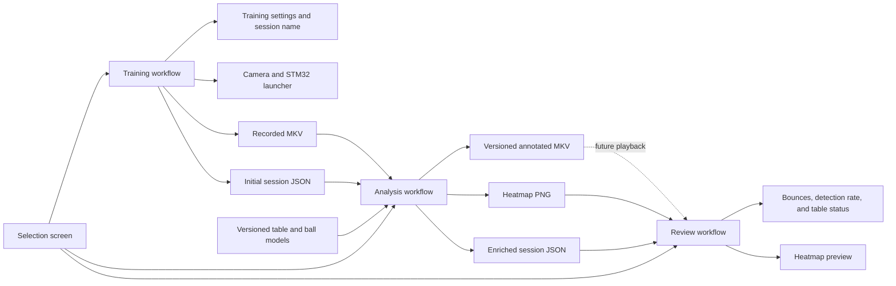

The main information lifecycle is:

```text
Training creates the recording and session record.
Analysis adds computer-vision results and artifacts.
Review reads and presents the saved information.
```

---

## Level 2: Training Workflow

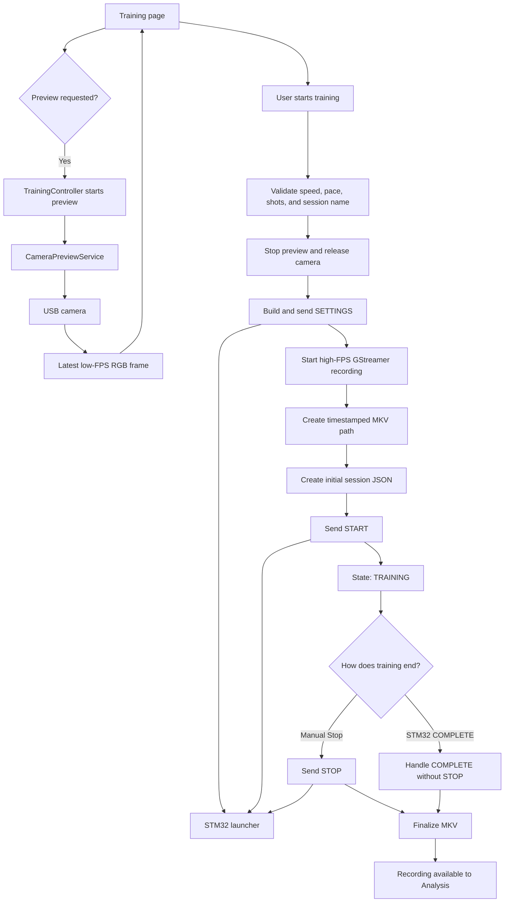

### Training ownership

| Responsibility | Owner |
| --- | --- |
| Widgets and status display | `gui/training_page.py` |
| State and operation order | `controller/training_controller.py` |
| Low-FPS preview | `capture/preview.py` |
| High-FPS MKV recording | `capture/recording.py` |
| STM32 protocol | `comm/serial.py` |
| Initial session metadata | `controller/training_controller.py` |

---

## Level 2: Analysis Workflow

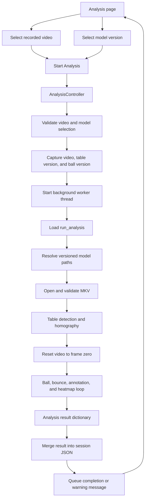

The GUI disables both dropdowns while analysis is running. The controller
captures the model selection before starting the thread so a running analysis
cannot change versions accidentally.

---

## Level 3: Model Selection and Loading

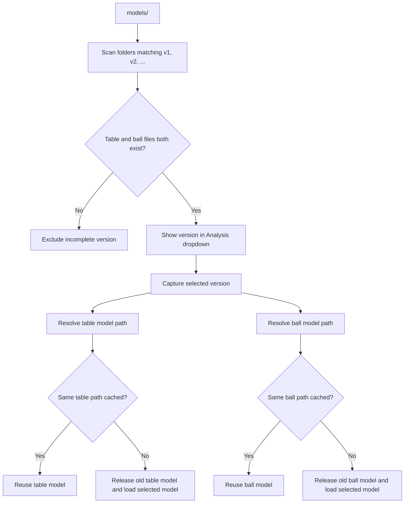

The current GUI uses one version for both models. The backend already supports
separate table and ball versions for future experiments.

---

## Level 3: Table Detection and Homography

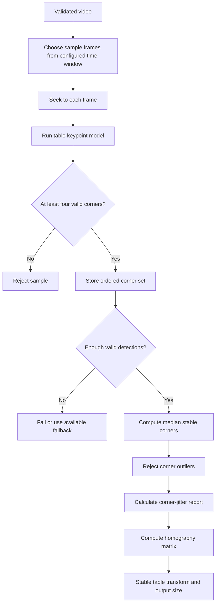

Homography maps image points onto a top-down table plane. It is appropriate for
table contact locations, but it does not reconstruct the true 3D position of an
airborne ball.

---

## Level 3: Frame-by-Frame Analysis Loop

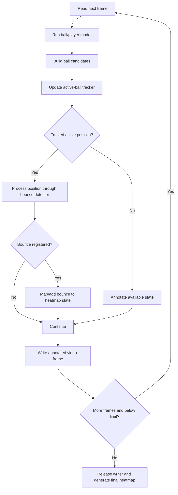

---

## Level 4: Active-Ball Tracking

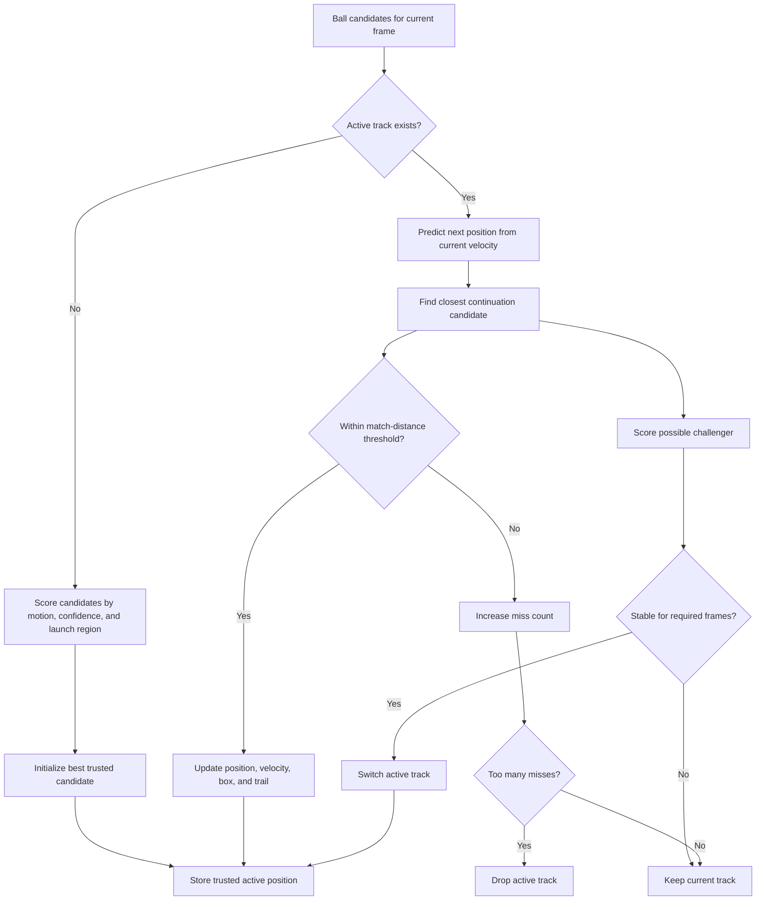

Only trusted active positions are sent to the bounce detector. This boundary is
important: `ball.py` decides which detection is the ball, while `bounce.py`
interprets the motion of that chosen track.

---

## Level 4: Current Bounce Algorithm

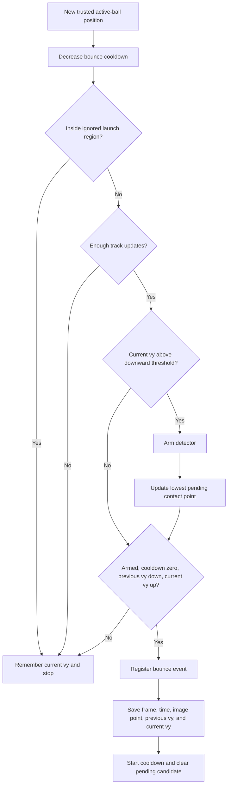

This detector uses an instantaneous consecutive-frame vertical-velocity
reversal. The planned temporal and perspective-aware improvements are documented
in [Bounce Detection Improvement Plan](bounce_detection_improvement_plan.md).

---

## Level 3: Annotation and Heatmap Outputs

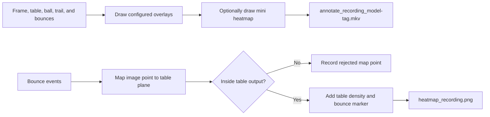

The annotated filename records the selected model tag. When both models use
`v2`, the output ends in `_v2.mkv`. A future mixed run can use a tag such as
`_table-v1_ball-v2.mkv`.

---

## Level 2: Session JSON Information Flow

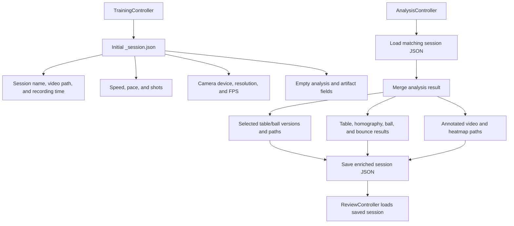

The session JSON is intended to be the source of truth connecting what the user
requested, what was recorded, which models produced the results, and which
artifacts were generated.

See [Session JSON Schema](session_json_schema.md) for field ownership, types,
examples, merge behavior, and compatibility rules.

---

## Level 2: Review Workflow

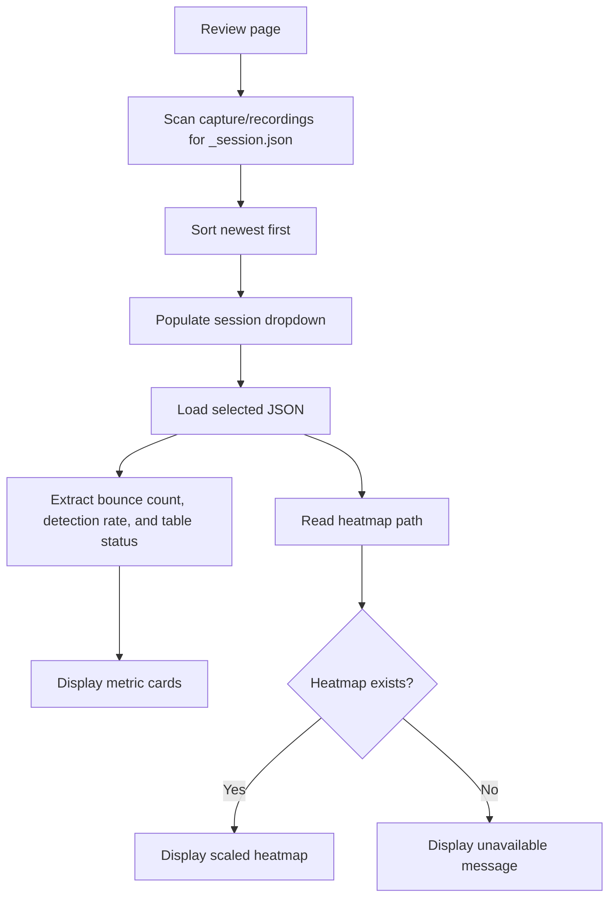

Review reads saved results. It does not rerun YOLO, homography, tracking, or
bounce detection.

---

## Process Ownership Summary

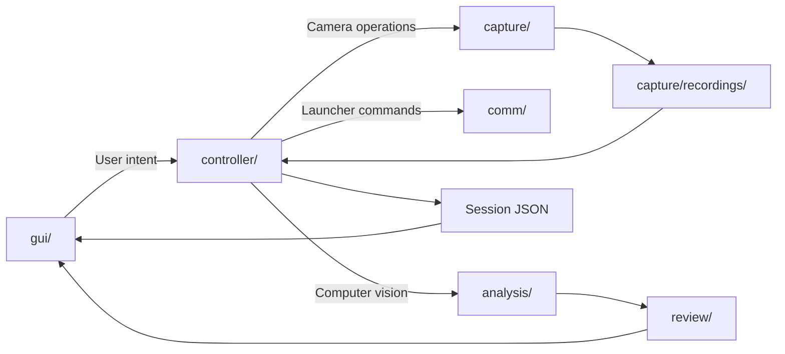

When adding a feature, identify which decision it makes:

```text
What should the user see?                 gui/
What operation happens next?              controller/
How is camera data acquired?              capture/
How is an STM32 command represented?       comm/
How is visual information calculated?      analysis/
How is saved session information shown?    Review GUI/controller
```
