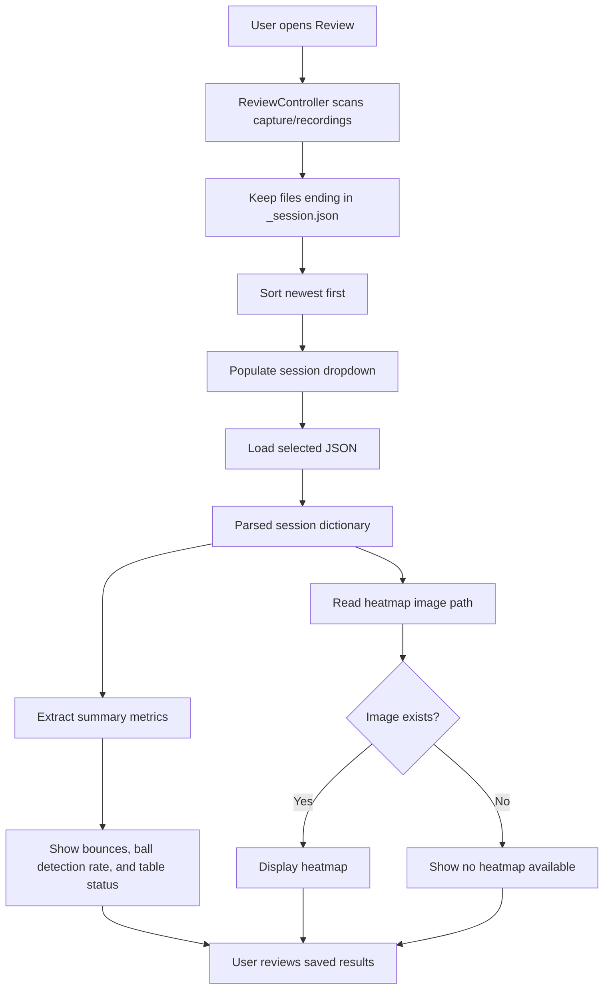

# Review Workflow

## Purpose

Review presents analysis that has already been saved. It does not run YOLO,
recalculate homography, or detect bounces.

```text
Analysis produces information.
Session JSON connects the information.
Review displays the information.
```

---

## Files Involved

| File or folder | Responsibility |
| --- | --- |
| `gui/review_page.py` | Select a session and display metrics and its heatmap. |
| `controller/review_controller.py` | Find, load, and interpret session JSON files. |
| `gui/scrollable_frame.py` | Keep Review usable on the touchscreen. |
| `capture/recordings/` | Store `_session.json` files beside recorded MKVs. |
| `review/heatmaps/` | Store heatmap images referenced by session JSON. |
| `review/annotated/` | Store annotated videos; playback is not yet exposed in Review. |
| `gui/review_page_old.py` | Preserved pre-session Review implementation. |

---

## Information Flow



The controller returns data; the page decides how it should look. Keeping those
jobs separate makes it possible to redesign Review without rewriting JSON access.

---

## Session Discovery

`ReviewController.list_available_sessions()` scans `capture/recordings/` and
accepts only filenames ending in `_session.json`. Sessions are sorted by file
modification time, newest first.

The GUI removes `_session` from the displayed dropdown name. Selecting an item
causes the complete JSON file to be loaded.

---

## Displayed Information

`ReviewController.extract_stats_from_session()` currently exposes:

| Display | JSON field |
| --- | --- |
| Total Bounces | `summary.total_bounces` |
| Ball Detection Rate | `ball_tracking.summary.detection_rate` |
| Table Status | `table.table_detected` |

The controller can also extract session name, recording time, homography status,
and frames containing the ball, although the current page does not display all
of them.

If `heatmap.image_path` exists and points to an image, Tkinter loads and scales
that image for the preview area. The page keeps an object reference to the image
because Tkinter images can disappear if Python garbage-collects them.

---

## Empty and Failure States

Review handles these cases without rerunning analysis:

- No session JSON exists: show that no sessions were found.
- Invalid or malformed JSON: show a failed-to-load status.
- No heatmap field exists: show that no heatmap is available.
- Heatmap path does not exist: show the same unavailable state.
- Refresh requested: rescan the recordings folder and reload the newest session.

---

## Current Boundary and Next Steps

Working in code:

- Session discovery and newest-first ordering
- JSON loading
- Bounce, detection-rate, and table-status metrics
- Heatmap preview
- Scrollable touchscreen layout

Not yet implemented or verified:

- End-to-end verification that Analysis finds every Training-created JSON
- Annotated-video playback
- More detailed ball and bounce diagnostics
- Session-to-session comparison
- Exportable reports

The main current risk is session identity. If Training uses a custom name for
the JSON but Analysis searches for a JSON based on the MKV stem, the analysis
merge will be skipped. One stable video-derived filename is the recommended fix.
