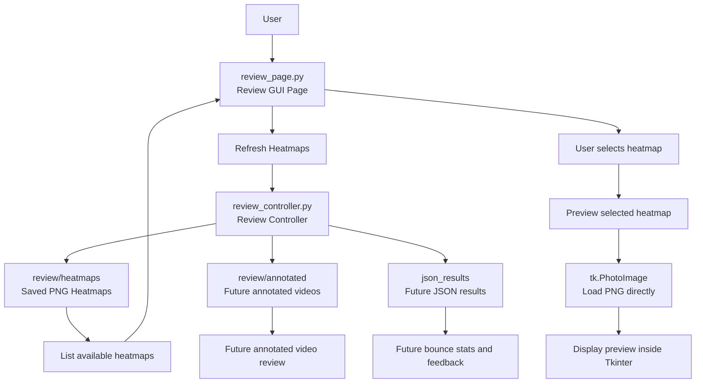
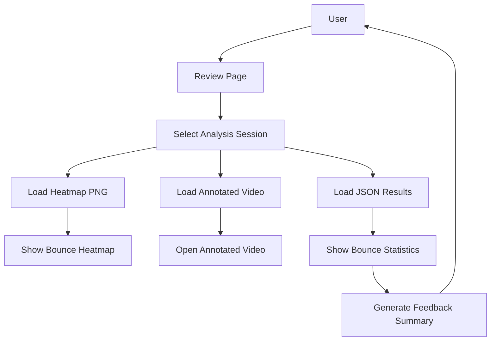

# Review Workflow

## Purpose

This document describes the Review workflow for the table-tennis training assistant.

The Review workflow is responsible for loading saved analysis outputs and showing them to the user.

The current Review workflow focuses on:

```text
- Listing saved heatmap PNG files
- Letting the user select a heatmap
- Previewing the selected heatmap inside Tkinter
```

The Review workflow should consume saved outputs. It should not rerun YOLO, analysis, homography, ball tracking, or bounce detection.

---

## Current Review Status

Current working features:

```text
- Review page exists in the GUI.
- Review Controller exists.
- Saved heatmaps can be listed from review/heatmaps.
- User can select a heatmap from a dropdown.
- Tkinter can preview the heatmap image inside the GUI.
```

Still planned:

```text
- Annotated video dropdown
- JSON result loading
- Bounce statistics display
- Feedback summary generation
- Better linkage between one recording, one heatmap, one annotated video, and one JSON result
```

---

## Review Workflow Flowchart



---

## Review Sequence

Current Review sequence:

```text
User opens Review page
↓
Review page asks Review Controller for saved heatmaps
↓
Review Controller scans review/heatmaps
↓
Heatmap dropdown is populated
↓
User selects a heatmap
↓
User clicks Preview Heatmap
↓
Tkinter loads the PNG image
↓
Heatmap appears inside the GUI
```

---

## Why Review Should Not Rerun Analysis

Review should only load saved outputs.

Good Review behavior:

```text
Load existing heatmap
Load existing annotated video
Load existing JSON results
Show summary to user
```

Bad Review behavior:

```text
Run YOLO again
Run homography again
Run ball tracking again
Run bounce detection again
```

Reason:

```text
Analysis is expensive and belongs in the Analysis workflow.
Review should be fast and should only display saved results.
```

---

## Review Controller Responsibilities

`controller/review_controller.py` is responsible for:

```text
- Locating saved review artifacts
- Listing saved heatmap files
- Sorting newest outputs first
- Returning file paths to the Review page
- Supporting optional external file opening in the future
```

It should not contain:

```text
- YOLO inference
- OpenCV analysis logic
- Homography math
- Bounce detection
- Heatmap generation
```

---

## Review Page Responsibilities

`gui/review_page.py` is responsible for:

```text
- Showing the Review page layout
- Displaying the heatmap dropdown
- Displaying Review status text
- Calling Review Controller methods
- Loading selected heatmap image for preview
- Keeping a reference to the loaded Tkinter image
```

Important Tkinter image rule:

```text
Keep the preview image stored as an instance variable.
```

Example:

```python
self.preview_image = image
```

This prevents the image from disappearing due to Python garbage collection.

---

## Current Output Folders

Current Review output folders:

```text
review/heatmaps/
    Saved heatmap PNG files

review/annotated/
    Saved annotated MKV videos

json_results/
    Future JSON result files
```

Current heatmap naming convention:

```text
heatmap_[original_video_name].png
```

Current annotated video naming convention:

```text
annotate_[original_video_name].mkv
```

---

## External Viewer Decision

External image opening is environment-dependent.

For example, external viewers may fail inside Docker or on the Jetson if tools like `xdg-open`, `gio`, or a default image viewer are unavailable.

Therefore, the main Review feature should be:

```text
Preview inside Tkinter
```

not:

```text
Open with external viewer
```

External opening can remain an optional convenience feature later.

---

## Future Review Workflow

Future Review workflow:



---

## Future Review Features

Recommended future features:

```text
1. Add annotated video dropdown.
2. Add JSON result dropdown.
3. Group outputs by original recording name.
4. Show total bounce count.
5. Show accepted vs rejected bounce count.
6. Show left/right placement summary.
7. Show short/deep placement summary.
8. Add simple feedback text.
```

Example future feedback:

```text
Total bounces detected: 21
Mapped bounces: 20
Rejected bounces: 1

Most bounces landed on the right half of the table.
Try mixing placement more evenly between left and right.
```

---

## Design Rules

Important Review design rules:

```text
review_page.py should only handle user interaction and preview display.
review_controller.py should locate saved output files.
Review should not rerun analysis.
Review should not depend on external image viewers.
Review should remain useful even if JSON output is not finished yet.
```

---

## Summary

The Review workflow is designed to be a lightweight saved-output viewer.

The current flow is:

```text
Review page
↓
Review Controller
↓
Saved heatmap PNG files
↓
Tkinter preview
```

Future Review improvements will add annotated video, JSON statistics, and feedback generation without changing the core Analysis pipeline.
