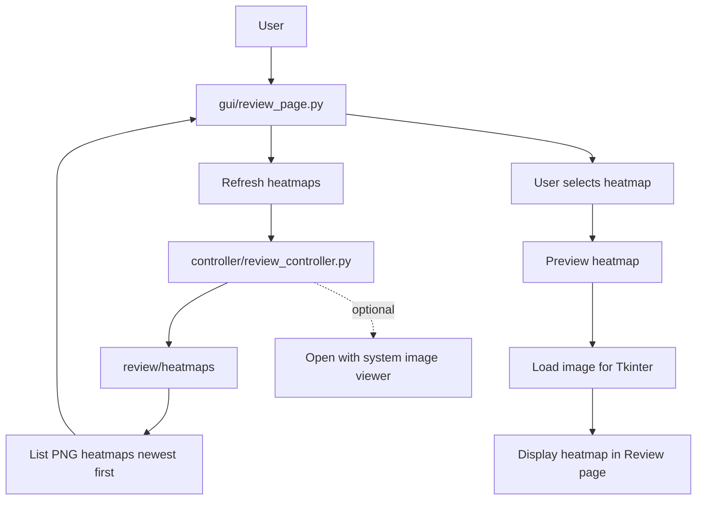
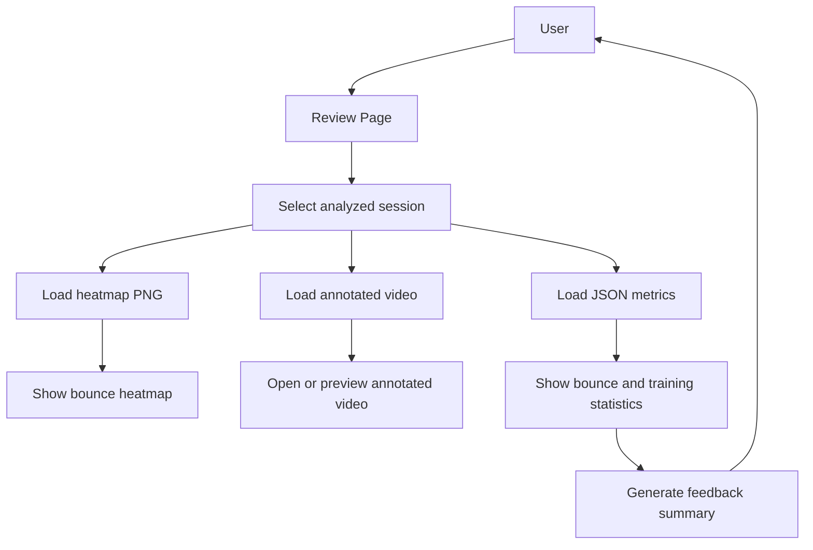

# Review Functionality

## Purpose

The Review workflow loads saved analysis outputs and presents them to the user.

Review is intentionally lightweight:

```text
Analysis creates outputs.
Review displays outputs.
```

The Review page should not rerun YOLO, homography, ball tracking, bounce detection, annotation, or heatmap generation.

---

## Main Files and Folders

| Path | Responsibility |
| --- | --- |
| `gui/review_page.py` | Tkinter page for selecting and previewing review artifacts. |
| `controller/review_controller.py` | Lists saved heatmaps and contains optional external-opening support. |
| `controller/review_controller_config.py` | Review folder paths and valid heatmap extensions. |
| `review/heatmaps/` | Heatmap PNG files generated by analysis. |
| `review/annotated/` | Annotated MKV videos generated by analysis. |
| `json_results/` | Future or partially integrated JSON analysis results. |

---

## Current Review Workflow



---

## Review Sequence

```text
User opens Review page
↓
Review page asks Review Controller for saved heatmaps
↓
Review Controller scans review/heatmaps
↓
Heatmap choices are sorted newest first
↓
User selects a heatmap
↓
Review page loads the PNG
↓
Heatmap preview is displayed inside Tkinter
```

---

## Saved Outputs

The analysis pipeline currently writes review artifacts to:

```text
review/heatmaps/
    heatmap_[recording_name].png

review/annotated/
    annotate_[recording_name].mkv
```

Future structured output belongs in:

```text
json_results/
    [recording_name]_analysis.json
```

The intended session relationship is:

```text
capture/recordings/session.mkv
review/annotated/annotate_session.mkv
review/heatmaps/heatmap_session.png
json_results/session_analysis.json
```

That relationship is not fully surfaced in the Review UI yet.

---

## Review Controller

`controller/review_controller.py` is responsible for:

```text
- Locating saved review artifacts
- Listing heatmap files
- Filtering by valid image extensions
- Sorting newest outputs first
- Returning paths to the Review page
- Containing optional external viewer support
```

It should not contain:

```text
- YOLO inference
- OpenCV video processing
- Homography math
- Ball tracking
- Bounce detection
- Heatmap generation
```

---

## Review Page

`gui/review_page.py` is responsible for:

```text
- Building the Review page layout
- Showing heatmap selection controls
- Calling the Review Controller
- Displaying status text
- Loading selected heatmap images
- Keeping the Tkinter image reference alive
```

Tkinter image references must be stored on the object. If the image is only a local variable, Python can garbage-collect it and the preview may disappear.

---

## External Viewer Behavior

External opening is optional because the deployment environment may not have a working desktop image viewer.

For example, `xdg-open` or `gio open` can fail inside containers, over X11 forwarding, or on minimal Jetson images.

The reliable primary behavior should be:

```text
Preview heatmaps inside Tkinter.
```

External viewers should remain a convenience feature only.

---

## Future Review Workflow



Future Review features:

```text
- Annotated video dropdown
- JSON result loading
- Bounce count and placement statistics
- Session grouping by source recording name
- Feedback summary for the player
- Comparison between multiple sessions
```

---

## Current Status

Working or mostly connected:

```text
- Review page exists
- Review controller exists
- Heatmap folder scanning exists
- Heatmap dropdown/selection exists
- Tkinter heatmap preview exists
```

Still improving:

```text
- Annotated video browsing
- JSON-backed statistics
- Session grouping
- External viewer reliability
- Automatic refresh after analysis completes
```
