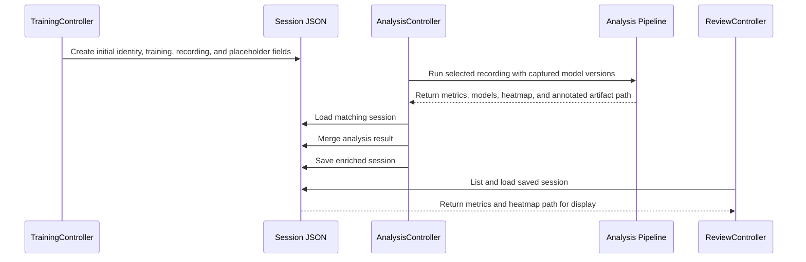
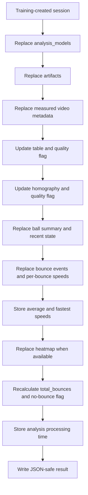

# Session JSON Schema

## Purpose

This document defines the current `_session.json` record shared by Training,
Analysis, and Review. It explains who owns each field, when it is populated, and
which fields may be empty.

Current schema version written by Training:

```text
2.0
```

Session JSON files are stored beside recordings in `capture/recordings/`.

---

## Lifecycle



The intended ownership rule is:

```text
Training creates identity and configuration.
Analysis writes computed results and artifact metadata.
Review reads but does not modify the record.
```

---

## Top-Level Structure

```json
{
  "session": {},
  "training_settings": {},
  "recording_settings": {},
  "video": {},
  "table": {},
  "homography": {},
  "bounces": [],
  "ball_tracking": {},
  "summary": {},
  "quality_flags": {},
  "heatmap": null,
  "analysis_models": {},
  "artifacts": {}
}
```

Historical session files may not contain `analysis_models` or `artifacts`
because those sections were added after the first JSON pipeline. Readers should
use safe defaults when a field is absent.

---

## Field Ownership Summary

| Section | Writer | Reader | Initial state |
| --- | --- | --- | --- |
| `session` | Training | Analysis, Review | Populated |
| `training_settings` | Training | Review/future reporting | Populated |
| `recording_settings` | Training | Analysis/future diagnostics | Populated |
| `video` | Analysis | Review/future reporting | Empty object |
| `table` | Analysis | Review, heatmap/reporting | Failure placeholder |
| `homography` | Analysis | Heatmap, Review/future diagnostics | Failure placeholder |
| `bounces` | Analysis | Review, heatmap/reporting | Empty list |
| `ball_tracking` | Analysis | Review | Empty summary/history |
| `summary` | Analysis | Review | Zero counts; no processing duration |
| `quality_flags` | Analysis | Review/future diagnostics | Conservative placeholders |
| `heatmap` | Analysis | Review | `null` |
| `analysis_models` | Analysis | Reproducibility/reporting | Empty object |
| `artifacts` | Analysis | Review/VLC playback | Annotated path is `null` |

---

## `session`

```json
{
  "session_name": "Training Session 20260708_154706",
  "recording_video_path": "/workspace/.../capture/recordings/gameplay_....mkv",
  "recording_time": "2026-07-08T15:47:06",
  "json_version": "2.0"
}
```

| Field | Type | Required | Meaning |
| --- | --- | --- | --- |
| `session_name` | string | Yes | Human-friendly session name. |
| `recording_video_path` | string | Yes | Path to the source MKV. |
| `recording_time` | ISO-8601 string | Yes | Time Training created the record. |
| `json_version` | string | Yes | Session schema version. |

Current paths are generally absolute and may contain container-specific prefixes
such as `/workspace`. A future schema should consider project-relative paths for
portability.

---

## `training_settings`

```json
{
  "ball_speed": 65,
  "pace_seconds": 0.5,
  "pace_milliseconds": 500,
  "number_of_shots": 10
}
```

| Field | Type | Unit | Meaning |
| --- | --- | --- | --- |
| `ball_speed` | integer | launcher value | Speed sent to STM32. |
| `pace_seconds` | number | seconds | User-facing pace. |
| `pace_milliseconds` | integer | milliseconds | Pace sent to STM32. |
| `number_of_shots` | integer | balls | Requested drill length. |

---

## `recording_settings`

```json
{
  "camera_device": "/dev/video0",
  "recording_width": 1280,
  "recording_height": 720,
  "recording_fps": 60
}
```

These fields record intended capture settings, not measured video metadata. The
`video` section contains the values read back from the completed file.

---

## `video`

```json
{
  "width": 1280,
  "height": 720,
  "fps": 60.0,
  "frame_count": 1408,
  "duration_seconds": 23.4667
}
```

| Field | Type | Unit |
| --- | --- | --- |
| `width` / `height` | integer | pixels |
| `fps` | number | frames/second |
| `frame_count` | integer | frames |
| `duration_seconds` | number | seconds |

---

## `table`

```json
{
  "table_detected": true,
  "corners": {
    "bottom_left": {"x": 329.0, "y": 670.0},
    "bottom_right": {"x": 1188.0, "y": 553.0},
    "top_right": {"x": 755.0, "y": 203.0},
    "top_left": {"x": 473.0, "y": 208.0}
  }
}
```

Corner coordinates are image pixels. Ordering is part of the contract because
homography depends on it.

If detection fails:

```json
{
  "table_detected": false,
  "corners": {}
}
```

---

## `homography`

```json
{
  "homography_found": true,
  "homography_matrix": [[0.0, 0.0, 0.0], [0.0, 0.0, 0.0], [0.0, 0.0, 1.0]],
  "source_points": [[0.0, 0.0], [1.0, 0.0], [1.0, 1.0], [0.0, 1.0]],
  "destination_points": [[0.0, 0.0], [1199.0, 0.0], [1199.0, 667.0], [0.0, 667.0]],
  "output_size": [1200, 668]
}
```

The matrix example above illustrates structure only. Real values come from the
detected table.

If homography fails, matrix/point fields are `null` and
`homography_found` is `false`.

---

## `bounces`

```json
[
  {
    "bounce_id": 1,
    "frame_index": 332,
    "time_seconds": 5.5333,
    "image_position": {"x": 674, "y": 400},
    "active_position_frame_index": 332,
    "active_position_time_seconds": 5.5333,
    "previous_vy": 1916.03,
    "current_vy": -147.24,
    "estimated_speed_kmh": 28.75,
    "speed_sample_count": 5,
    "speed_method": "pre_bounce_table_plane"
  }
]
```

| Field | Meaning |
| --- | --- |
| `bounce_id` | One-based ID within the session. |
| `frame_index` / `time_seconds` | Frame/time at which tracker.py confirmed the reversal. |
| `image_position` | Lowest stored bbox-bottom point from the preceding descent. |
| `active_position_*` | Compatibility copy of the confirmation frame/time. |
| `previous_vy` / `current_vy` | Image-space velocities used by the current detector. |
| `estimated_speed_kmh` | Optional incoming 2D table-plane speed estimate. |
| `speed_sample_count` | Number of valid pre-bounce segment speeds used. |
| `speed_method` | Estimation method identifier; currently `pre_bounce_table_plane`. |

Speed fields are omitted when homography or sufficient valid incoming samples
are unavailable. They are estimates from a single camera, not full 3D radar
measurements.

Future temporal bounce detection may add confidence, rejection diagnostics,
smoothed velocities, direction-change score, and mapped table positions. Schema
changes should increment `json_version`.

---

## `ball_tracking`

```json
{
  "summary": {
    "frames_processed": 1393,
    "frames_with_ball": 613,
    "frames_with_candidates": 912,
    "total_candidates": 1297,
    "detection_rate": 0.4401,
    "active_track_switches": 3,
    "active_track_drops": 22,
    "recent_position_count": 12
  },
  "recent_positions": [],
  "active_trail": []
}
```

Each recent position can include frame/time, center, bbox bottom, confidence,
velocity, update count, and launch-region status. Only a limited recent history
is persisted; this is not currently the complete trajectory.

---

## `summary` and `quality_flags`

```json
{
  "summary": {
    "total_bounces": 1,
    "average_return_speed_kmh": 28.75,
    "fastest_return_speed_kmh": 28.75,
    "speed_bounces_measured": 1,
    "analysis_processing_time_seconds": 23.45
  },
  "quality_flags": {
    "table_detection_failed": false,
    "homography_failed": false,
    "no_bounces_detected": false
  }
}
```

`analysis_processing_time_seconds` is an optional numeric duration measured with
a monotonic clock. It covers `run_analysis()` from pipeline entry through output
generation and video cleanup. Historical or Training-only session files may omit
the field. The GUI formats an available value to two decimal places.

The average and fastest return speeds summarize only bounces that received a
valid estimate. `speed_bounces_measured` reports that denominator. Historical
sessions may omit all three fields until their recordings are analyzed again.

Quality flags describe pipeline outcomes, not guaranteed physical accuracy. For
example, `no_bounces_detected=false` means at least one event was registered; it
does not prove that every event is a real table bounce.

---

## `heatmap`

When generated, the heatmap object is supplied by `analysis/heatmap.py` and is
expected to include an `image_path` used by Review. It may also include mapped/
rejected counts and output information depending on the active result structure.

When unavailable:

```json
null
```

Review must verify that `image_path` exists before attempting to display it.

---

## `analysis_models`

```json
{
  "table_version": "v2",
  "ball_version": "v2",
  "output_tag": "v2",
  "table_model_path": "/workspace/.../models/v2/table_pose_02.pt",
  "ball_model_path": "/workspace/.../models/v2/ball_player_detect_02.pt"
}
```

This section makes the analysis reproducible. A future mixed selection can use:

```json
{
  "table_version": "v1",
  "ball_version": "v2",
  "output_tag": "table-v1_ball-v2"
}
```

---

## `artifacts`

```json
{
  "annotated_video_path": "/workspace/.../review/annotated/annotate_gameplay_v2.mkv"
}
```

The path is `null` when annotation is disabled or the writer could not be
created. Review enables its **Open Annotated Video** button when the file can be
resolved locally, and opens the video using VLC.

The heatmap currently remains in its own top-level section rather than inside
`artifacts`.

---

## Merge Behavior

`analysis/log_json.py` merges fields in this order:



NumPy arrays and other non-native values are converted to JSON-safe lists or
numbers before saving.

---

## Filename Contract and Known Limitation

Intended default relationship:

```text
capture/recordings/gameplay_123.mkv
capture/recordings/gameplay_123_session.json
review/annotated/annotate_gameplay_123_v2.mkv
review/heatmaps/heatmap_gameplay_123.png
```

Current Training code can use a custom user session name in the JSON filename,
while Analysis derives the expected JSON path from the recording stem. A custom
name can therefore cause Analysis to miss the session JSON and skip the merge.

Recommended correction:

```text
Always derive the JSON filename from the recording stem.
Store the human-friendly session name inside session.session_name.
```

---

## Compatibility Rules

Readers should:

- Use `.get()` and safe defaults for optional/new fields.
- Treat missing `analysis_models` and `artifacts` as historical schema data.
- Check boolean success fields before reading dependent values.
- Check artifact paths exist before opening files.
- Avoid assuming absolute paths are valid on another machine/container.

Writers should:

- Preserve unknown fields when merging.
- Convert data to JSON-safe values.
- Increment `json_version` for incompatible structural changes.
- Add fields rather than silently changing units or meanings.
- Keep training identity separate from analysis results.

---

## Validation Checklist

```text
[ ] JSON parses successfully.
[ ] json_version is present.
[ ] recording_video_path identifies the intended MKV.
[ ] training pace seconds and milliseconds agree.
[ ] video dimensions/FPS match the analyzed file.
[ ] table corners exist when table_detected is true.
[ ] homography fields exist when homography_found is true.
[ ] summary.total_bounces equals len(bounces).
[ ] no_bounces_detected equals (len(bounces) == 0).
[ ] model paths match the selected model versions.
[ ] annotated and heatmap paths exist when non-null.
```
