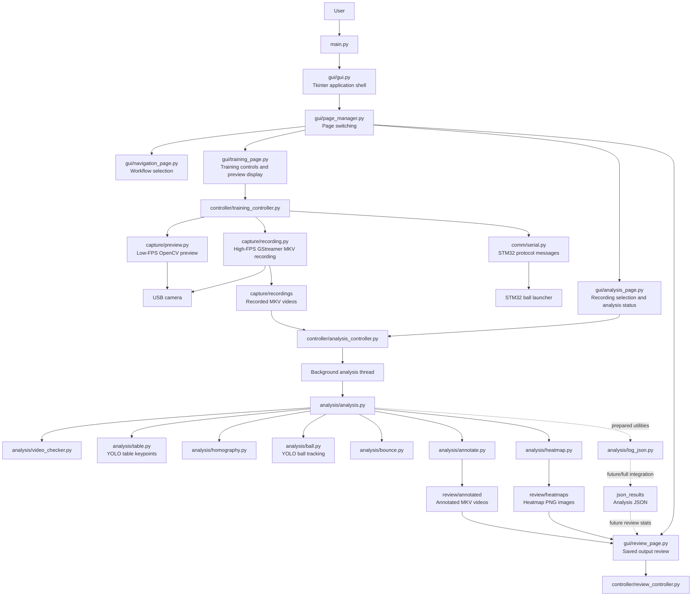
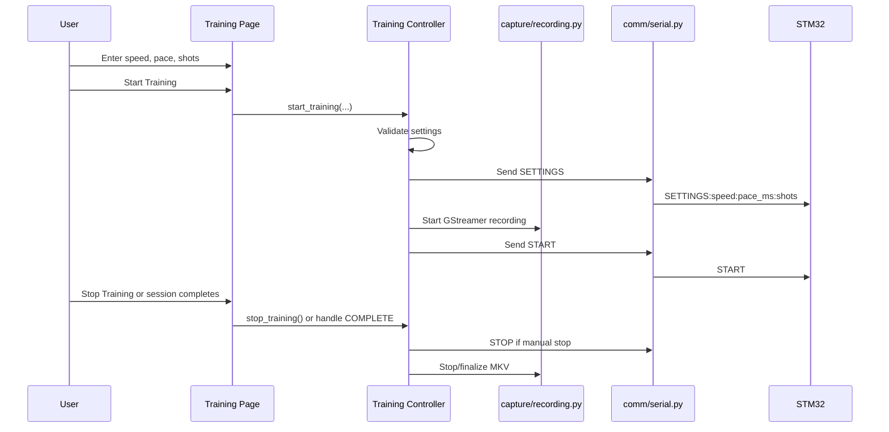
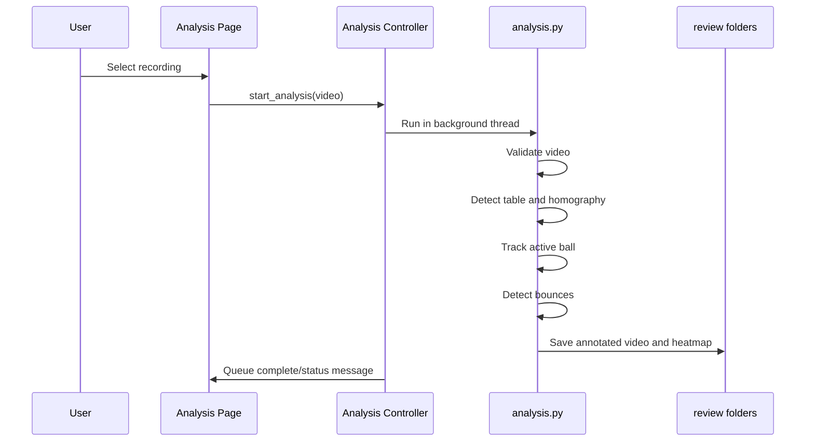

# Software Architecture

## Purpose

This document describes the overall architecture of the T-Cubed Jetson software.

T-Cubed is a table-tennis training assistant that connects:

```text
Tkinter GUI
Jetson camera capture
YOLO computer vision
OpenCV analysis
STM32 launcher control
Saved review outputs
```

The system is intentionally organized as layers. Each layer has a small job, and the lower-level modules do the hardware or computer-vision work.

---

## Architecture Summary

```text
User
  ↓
Tkinter GUI Pages
  ↓
Controller Layer
  ↓
Functional Modules
  ↓
Hardware / Files / Saved Outputs
```

The main design rule is:

```text
GUI pages handle user interaction.
Controllers coordinate workflows and state.
Functional modules do the actual work.
```

This keeps camera code, serial code, YOLO inference, OpenCV processing, and review display logic separated.

---

## System Diagram



---

## Layer Responsibilities

| Layer | Files | Responsibility |
| --- | --- | --- |
| Entry point | `main.py` | Launch the Tkinter GUI only. |
| GUI | `gui/` | Show pages, inputs, buttons, preview frames, status text, and saved review outputs. |
| Controllers | `controller/` | Validate user requests, coordinate state, start background work, and connect GUI events to functional modules. |
| Capture | `capture/` | Open camera preview and record high-FPS training video. |
| Analysis | `analysis/` | Run YOLO/OpenCV processing, track the ball, detect bounces, and generate review outputs. |
| Communication | `comm/` | Build and send STM32 serial protocol messages. |
| Models | `models/` | Store YOLO weights used by table and ball/player detection. |
| Outputs | `capture/recordings`, `review/`, `json_results/` | Store videos, annotated videos, heatmaps, and future structured results. |

---

## Runtime Workflows

### Training / Capture



### Analysis / Review



---

## Important Boundaries

The project depends on clear ownership boundaries:

```text
GUI files should not run YOLO.
GUI files should not open serial devices directly.
GUI files should not own camera capture loops.
Controllers should not contain OpenCV/YOLO algorithms.
Analysis modules should not create Tkinter widgets.
Review should load saved outputs, not rerun analysis.
```

These boundaries make it possible to test or replace one subsystem without rewriting the whole app.

---

## Current Integration Status

Working or mostly connected:

```text
- Page-based Tkinter GUI
- Training settings validation
- Low-FPS camera preview service
- High-FPS GStreamer/MKV recording service
- STM32 SETTINGS / START / STOP command building and sending
- Background-thread analysis controller
- Table keypoint detection
- Stable homography calculation
- Active ball tracking
- Bounce detection
- Annotated video output
- Heatmap image output
- Review heatmap listing and preview
```

Prepared or partially integrated:

```text
- STM32 response listener loop
- Automatic end-to-end COMPLETE handling from a live serial reader
- Rich JSON analysis export from the main pipeline
- Review statistics loaded from JSON
- Player-specific metrics
- Table detection overlay during preview
```

---

## Why This Architecture Fits the Project

The Jetson needs to coordinate hardware, computer vision, and a user-facing GUI at the same time. Keeping the system layered prevents expensive or fragile work from leaking into the UI.

For example:

```text
If preview fails, recorded-video analysis can still be tested.
If STM32 communication fails, existing recordings can still be analyzed.
If heatmap generation fails, ball and bounce data can still be useful.
If the Review page changes, the analysis pipeline should not need to change.
```

That separation is the core architecture of the project.
