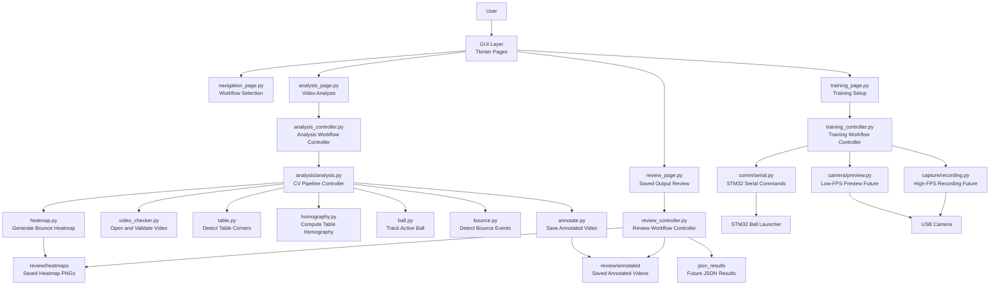

# Software Architecture

## Overall Software Architecture

The table-tennis training assistant uses a layered, controller-based architecture.

```text
Tkinter GUI Pages
    ↓
Controller Layer
    ↓
Functional Modules
    ↓
Hardware / Files / Saved Outputs
```

The main design rule is:

```text
GUI pages handle user interaction.
Controllers coordinate workflows.
Functional modules do the actual work.
```

This keeps the system modular, easier to debug, and safer to expand as new features are added.

---

## Overall Flowchart



---

## Layer Responsibilities

| Layer              | Responsibility                                                                            |
| ------------------ | ----------------------------------------------------------------------------------------- |
| GUI Layer          | Shows pages, buttons, inputs, status text, and review previews                            |
| Controller Layer   | Coordinates workflows and manages state                                                   |
| Functional Modules | Perform serial communication, recording, analysis, annotation, and heatmap generation     |
| Hardware / Files   | Camera, STM32, recorded videos, saved heatmaps, annotated videos, and future JSON results |

---

## Current Architecture Notes

The current working GUI is page-based:

```text
gui.py
    owns the main Tkinter window

page_manager.py
    switches between pages

navigation_page.py
    welcome / workflow selection page

training_page.py
    training settings and controls

analysis_page.py
    selected-video analysis workflow

review_page.py
    saved heatmap review workflow
```

The current controller layer includes:

```text
training_controller.py
    coordinates training state and STM32 command flow

analysis_controller.py
    starts analysis in a background thread

review_controller.py
    lists saved review artifacts
```

The analysis pipeline is intentionally modular:

```text
analysis.py
    controls the computer vision pipeline

video_checker.py
    opens and validates video

table.py
    detects table corners

homography.py
    maps image coordinates to table coordinates

ball.py
    tracks the active ball

bounce.py
    detects bounce events

annotate.py
    draws offline annotated videos

heatmap.py
    creates bounce heatmaps
```

---

## Why This Architecture Is Useful

This design keeps each section isolated.

Examples:

```text
If the Review page changes, the Analysis page should not break.

If heatmap generation fails, ball tracking and bounce detection can still be useful.

If STM32 communication fails, recorded video analysis can still be tested.

If camera preview fails, high-FPS recording can still be developed separately.
```

This makes the system easier to test, explain, and expand during the capstone project.
