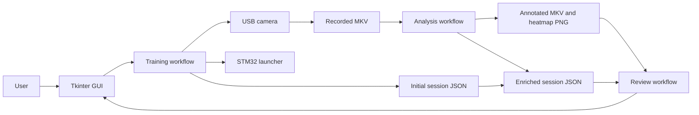
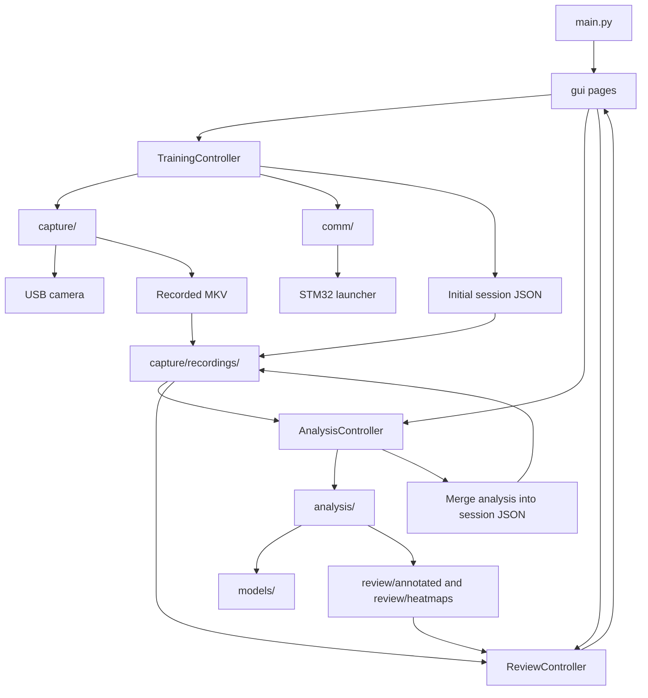
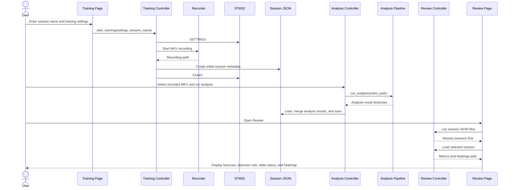
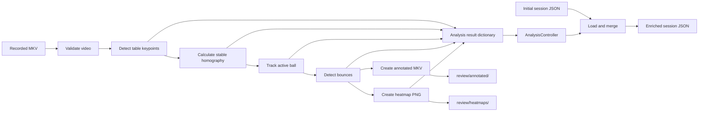

# T-Cubed Software Architecture and Information Flow

## Purpose

This is the system-level overview of the T-Cubed Jetson application. It explains
how information moves between the user interface, controller layer, camera,
STM32 launcher, computer-vision pipeline, saved session data, and Review page.

For file-by-file responsibilities, see [Codebase Functionality Map](codebase_functionality.md).
For workflow details, see [Training](training_workflow.md),
[Analysis](analysis_pipeline.md), and [Review](review_workflow.md).

---

## System in One View

T-Cubed records a table-tennis training session, analyzes the saved video, and
presents the saved results later.



The central design is:

```text
Training creates the session.
Analysis enriches the session.
Review reads the session.
```

The recorded video is the analysis input. The `_session.json` file is intended
to be the structured source of truth that connects the training settings,
recording, analysis metrics, and review artifacts.

---

## Layered Architecture



| Layer | Main location | Responsibility |
| --- | --- | --- |
| Entry point | `main.py` | Start the application. |
| GUI | `gui/` | Collect input and display state, previews, metrics, and results. |
| Controllers | `controller/` | Validate requests and coordinate multi-step workflows. |
| Capture | `capture/` | Run low-FPS preview and high-FPS MKV recording. |
| Communication | `comm/` | Own the Jetson-to-STM32 serial protocol. |
| Analysis | `analysis/` | Detect the table and ball, calculate homography and bounces, and generate outputs. |
| Models | `models/` | Store trained YOLO weights. |
| Persistent data | `capture/recordings/`, `review/` | Store recordings, session JSON, annotated videos, and heatmaps. |

### Why controllers exist

Camera access, serial communication, recording, and computer vision are slower
and more failure-prone than ordinary GUI work. A controller keeps their order
and state out of Tkinter widgets:

```text
GUI page -> controller -> functional module
```

This is a common solution when one user action must coordinate several systems.
The page says what the user requested; the controller decides how to carry it out.

---

## End-to-End Information Flow



### Stage 1: Training creates the session

The user provides:

- An optional session name
- Ball speed
- Pace between shots
- Number of shots

`TrainingController` validates those values, starts recording, sends commands to
the STM32, and creates an initial `_session.json` beside the MKV recording. The
JSON contains the training and recording settings plus empty analysis fields.

### Stage 2: Analysis enriches the session

The Analysis page selects an existing MKV. `AnalysisController` runs the
computer-vision pipeline in a background thread. The returned result includes
video, table, homography, ball-tracking, bounce, and heatmap information.

The controller then uses `analysis/log_json.py` to merge those results into the
existing session JSON. Analysis failures are reported as warnings instead of
crashing the GUI.

### Stage 3: Review reads the session

`ReviewController` scans `capture/recordings/` for `_session.json` files. The
Review page loads the selected JSON and displays key metrics. If the JSON
contains a valid heatmap path, the image is loaded from `review/heatmaps/`.

Review does not rerun YOLO or recompute results. It only displays saved data.

---

## Session Data Model

An initial session record has this shape:

```text
session
  session_name
  recording_video_path
  recording_time
  json_version

training_settings
  ball_speed
  pace_seconds
  pace_milliseconds
  number_of_shots

recording_settings
  camera_device
  recording_width
  recording_height
  recording_fps

video
table
homography
ball_tracking
bounces
summary
quality_flags
heatmap
```

Training fills the identity and configuration fields. Analysis fills or updates
the result fields. Review reads the finished structure.

The separate `json_results/` directory belongs to the older analysis-log design.
The current session flow stores `_session.json` files beside recordings in
`capture/recordings/`.

---

## Training and Hardware Flow

Training deliberately uses two camera paths:

| Path | Module | Purpose |
| --- | --- | --- |
| Preview | `capture/preview.py` | Low-FPS OpenCV display for camera setup. |
| Recording | `capture/recording.py` | High-FPS GStreamer recording for offline analysis. |

The intended start order is:

```text
Validate settings
Stop preview if necessary
Send SETTINGS to STM32
Start MKV recording
Create initial session JSON
Send START to STM32
```

Starting recording before `START` avoids losing the beginning of the training
session. Recording and analysis are separate because running the full CV
pipeline live would make training and the GUI less reliable.

---

## Analysis Flow



`AnalysisController` runs this work in a background thread. Messages cross back
to Tkinter through a queue because worker threads should not update GUI widgets
directly.

`BALL_ANALYSIS_MAX_FRAMES` is currently `None`, so the configured pipeline is no
longer limited to the earlier 600-frame test window.

---

## Ownership Rules

```text
main.py launches the GUI.
GUI pages build widgets and display information.
Controllers own workflow order, validation, and state.
capture/ owns camera preview and recording.
comm/ owns serial message formatting and device communication.
analysis/ owns computer-vision algorithms and result conversion.
Review loads saved results; it does not run analysis.
```

When deciding where new code belongs, ask what kind of decision it makes:

| Question | Location |
| --- | --- |
| What should the user see or enter? | `gui/` |
| What operation happens next? | `controller/` |
| How is camera data captured? | `capture/` |
| How is the STM32 message formatted? | `comm/` |
| How is a table, ball, or bounce detected? | `analysis/` |
| How is saved session data presented? | Review GUI/controller |

---

## Current Integration Status

Connected in code:

- Page-based touchscreen GUI with scrollable content
- Low-FPS preview and high-FPS MKV recording
- STM32 `SETTINGS`, `START`, and `STOP` commands
- Initial session JSON creation during Training
- Background-thread video analysis
- Table, homography, ball, bounce, annotation, and heatmap stages
- Analysis-result merge into session JSON
- Session-based Review metrics and heatmap loading

Needs verification or further integration:

- The Week 8 JSON pipeline was committed as untested and needs an end-to-end run.
- A custom session name can produce a JSON filename that differs from the
  video-stem filename Analysis currently searches for.
- Automatic continuous reading of STM32 `COMPLETE` messages is not connected.
- Annotated-video playback is not surfaced in the Review page.
- Player-specific metrics and session comparison are not implemented.

The highest-priority data-flow fix is to give every session one stable identity.
The usual solution is to name the JSON from the recording stem and keep the
human-friendly session name inside the JSON.
