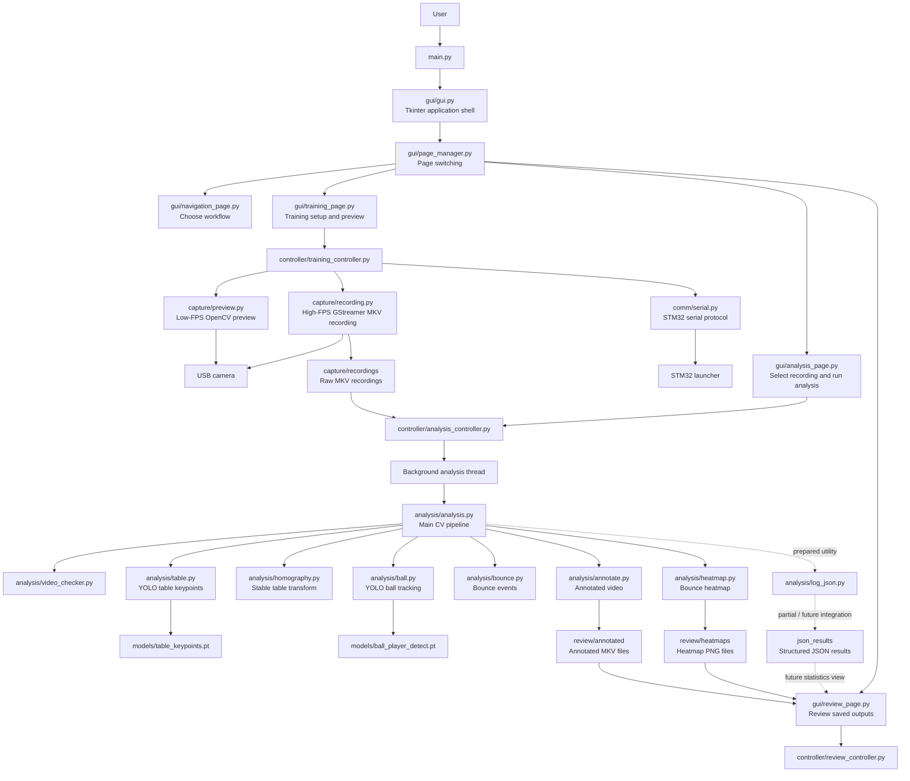
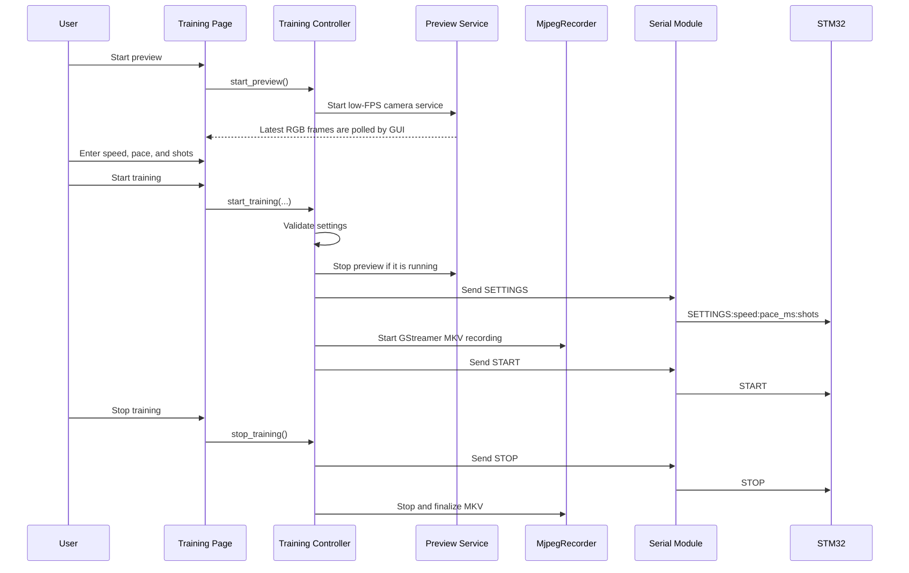
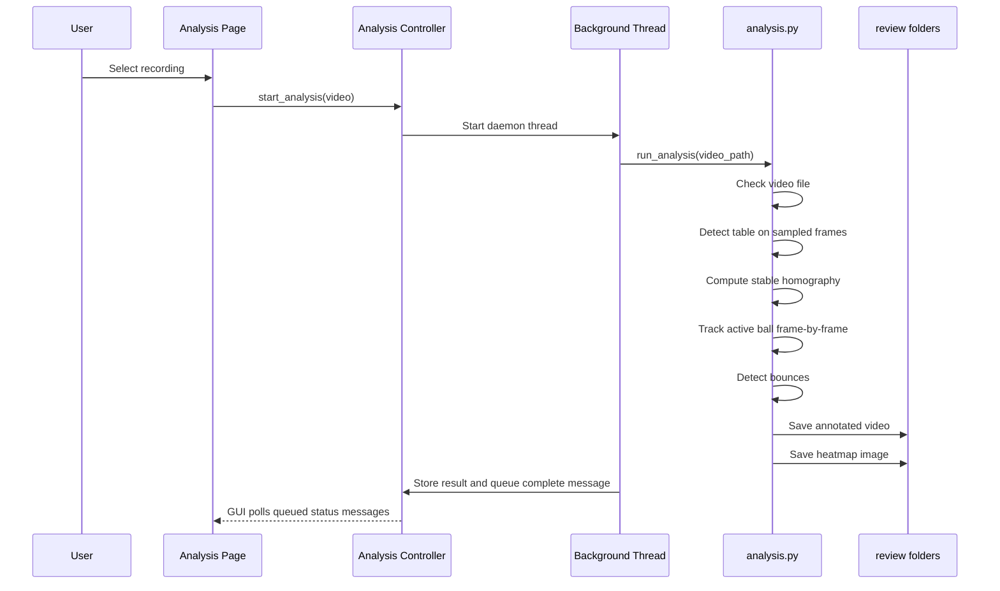
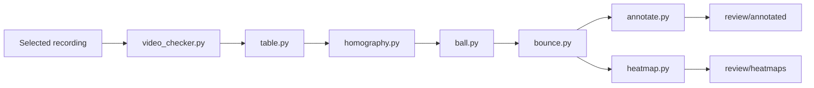

# Software Architecture

## Purpose

This document explains the software architecture of the T-Cubed Jetson project.

T-Cubed is a table-tennis training assistant. The Jetson application connects the
user interface, camera capture, computer vision analysis, STM32 launcher control,
and saved review outputs.

The important idea is that the project is split into layers:

```text
Tkinter GUI
Controller workflow layer
Capture / communication / analysis modules
Hardware, model files, recordings, and review outputs
```

Each layer has one main job. This makes the project easier to understand and
safer to change because GUI code, hardware code, and computer vision code do not
all live in the same place.

---

## Architecture Summary



The shortest version is:

```text
main.py starts the GUI.
GUI pages collect user input and display status.
Controllers coordinate the workflows.
Functional modules do camera, serial, recording, and analysis work.
Outputs are saved for the Review page to load later.
```

---

## Layer Responsibilities

| Layer | Files | Responsibility |
| --- | --- | --- |
| Entry point | `main.py` | Launch the GUI. It should stay small. |
| GUI | `gui/` | Show pages, inputs, buttons, preview frames, status text, and saved outputs. |
| Controllers | `controller/` | Validate requests, manage workflow state, start background work, and connect GUI actions to functional modules. |
| Capture | `capture/` | Own camera preview and high-FPS training recording. |
| Communication | `comm/` | Build, send, and read STM32 serial protocol messages. |
| Analysis | `analysis/` | Run YOLO/OpenCV processing, table homography, ball tracking, bounce detection, annotation, and heatmap generation. |
| Shared objects | `classes/` | Hold object shapes shared by analysis modules. |
| Models | `models/` | Store trained YOLO model weights. |
| Outputs | `capture/recordings`, `review/`, `json_results/` | Store raw recordings, annotated videos, heatmaps, and partial/future JSON results. |

---

## Key Design Decision: Why Use Controllers?

The project has a common software problem:

```text
The GUI needs to start real work, but the real work is slow, hardware-related,
or computer-vision-heavy.
```

The common solution is to put a controller between the GUI and the functional
modules.

```text
GUI page -> controller -> functional module
```

For example, the Training page should not directly build serial messages or run
GStreamer. It calls `TrainingController`, and the controller decides the correct
sequence:

```text
validate settings
stop preview if needed
send SETTINGS to STM32
start recording
send START to STM32
track training state
```

This is useful because a GUI page can stay focused on user interaction while the
controller owns the workflow rules.

---

## Runtime Workflow: Training

Training has two camera paths on purpose:

| Camera path | Module | Purpose |
| --- | --- | --- |
| Preview | `capture/preview.py` | Low-FPS OpenCV preview for setup. |
| Recording | `capture/recording.py` | High-FPS GStreamer recording to MKV for later analysis. |

The preview path is for the user to see the camera. The recording path is for
capturing better video data without forcing the GUI to process every frame.



`TrainingController.handle_stm32_message()` is prepared for incoming STM32
messages such as `COMPLETE`, `ACK`, and `ERR`. The controller can react to
`COMPLETE` by stopping recording without sending another `STOP`. The automatic
live serial listener loop is still a prepared/future integration point.

---

## Runtime Workflow: Analysis

Analysis runs from a saved recording instead of the live preview stream.

That is another key design decision:

```text
Record first, analyze after.
```

This is simpler and more reliable for the current project because YOLO,
homography, bounce detection, annotation, and heatmap generation are expensive.
Running them offline avoids freezing the Tkinter interface during training.



The analysis controller dynamically loads `analysis/analysis.py` and runs
`run_analysis(video_path)` in a background thread. This keeps the GUI responsive
while the computer vision pipeline runs.

---

## Analysis Pipeline

The main analysis pipeline lives in `analysis/analysis.py`. It coordinates
smaller analysis modules:



Current primary analysis results are:

```text
- Video metadata
- Detected table corners
- Stable homography information
- Active ball tracking summary
- Bounce count
- Bounce event positions and times
- Optional annotated video path
- Optional heatmap image path
```

`analysis/log_json.py` provides JSON-safe logging helpers, but rich JSON export
is not the main end-to-end output yet. Treat `json_results/` as partial/future
structured results unless the pipeline is later updated to persist full JSON
metrics every run.

---

## Review Workflow

The Review page is intentionally a viewer for saved artifacts.

```text
Review should load outputs that already exist.
Review should not rerun YOLO.
Review should not recompute homography or bounces.
```

Currently, `ReviewController` lists heatmap images from `review/heatmaps`.
Annotated videos are saved into `review/annotated`, and richer statistics from
JSON are a future integration point.

---

## Ownership Boundaries

These boundaries are the rules that keep the codebase understandable:

```text
main.py should only launch the GUI.
GUI pages should not run YOLO.
GUI pages should not open serial devices directly.
GUI pages should not own camera capture loops.
Controllers should not contain OpenCV/YOLO algorithms.
Analysis modules should not create Tkinter widgets.
Review should load saved outputs, not rerun analysis.
Serial message formatting should stay in comm/serial.py.
Recording details should stay in capture/recording.py.
```

When you are unsure where a new feature belongs, ask:

```text
Is this about what the user sees? Put it in gui/.
Is this about workflow order or state? Put it in controller/.
Is this about camera capture? Put it in capture/.
Is this about STM32 messages? Put it in comm/.
Is this about computer vision? Put it in analysis/.
Is this about viewing saved results? Put it in review/controller GUI code.
```

---

## Current Integration Status

Working or mostly connected:

```text
- Page-based Tkinter GUI
- Training settings validation
- Low-FPS OpenCV camera preview
- High-FPS GStreamer/MKV recording through MjpegRecorder
- STM32 SETTINGS / START / STOP command building and sending
- Background-thread analysis controller
- Video checking and metadata extraction
- Table keypoint detection
- Multi-sample stable homography calculation
- Active ball tracking
- Bounce detection
- Annotated video output
- Heatmap image output
- Review heatmap listing and preview
```

Prepared or partially integrated:

```text
- Automatic live STM32 response listener loop
- End-to-end COMPLETE handling from a live serial reader
- Rich JSON analysis export from the main pipeline
- Review statistics loaded from JSON
- Player-specific metrics
- Table detection overlay during live preview
- Full review support for annotated videos
```

---

## Why This Architecture Fits the Project

The Jetson has to coordinate hardware, computer vision, and a user-facing GUI.
Those jobs fail in different ways and run at different speeds.

The layered architecture protects the project from one part breaking every other
part:

```text
If preview fails, saved recordings can still be analyzed.
If STM32 communication fails, existing recordings can still be reviewed.
If analysis is slow, the GUI can stay responsive because analysis runs in a thread.
If heatmap generation fails, ball and bounce data may still be useful.
If the Review page changes, the analysis pipeline should not need to change.
```

That separation is the core software architecture of the project.
