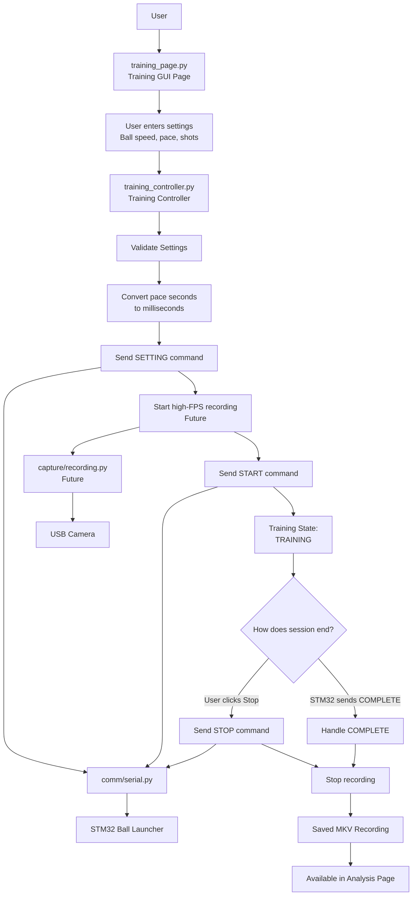
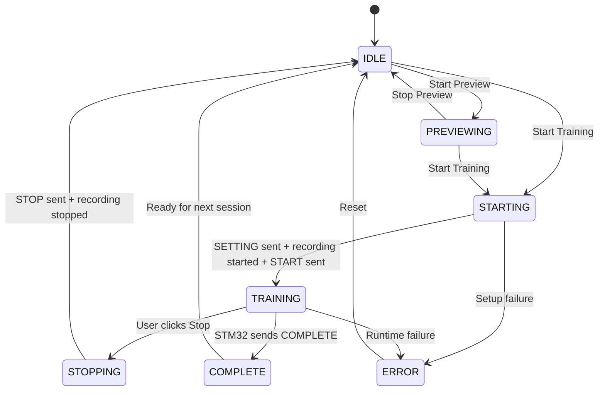

# Training Workflow

## Purpose

This document describes the Training workflow for the table-tennis training assistant.

The Training workflow is responsible for:

```text
- Accepting user training settings
- Sending settings to the STM32 ball launcher
- Starting and stopping a training session
- Starting and stopping recording in the future
- Handling STM32 COMPLETE messages in the future
```

The Training page should remain part of the layered controller-based architecture:

```text
training_page.py
    ↓
training_controller.py
    ↓
comm/serial.py / capture/recording.py / camera preview modules
    ↓
STM32 / Camera / Saved Recording
```

The GUI page should only display controls and status. It should not contain low-level serial communication, GStreamer recording, camera capture loops, or YOLO table detection logic.

---

## Current Training Status

Current working features:

```text
- Training page exists in the GUI.
- Training Controller exists.
- Training settings are validated.
- Pace is converted from seconds to milliseconds.
- STM32 SETTING, START, and STOP payloads can be built.
- Real STM32 serial sending has been tested.
- GUI-to-controller-to-serial flow is working.
```

Still planned:

```text
- STM32 response listener
- Automatic COMPLETE detection
- Real GStreamer recording integration
- Low-FPS camera preview
- Table detection overlay during preview
```

---

## Training Workflow Flowchart



---

## Training Sequence

The intended final Start Training sequence is:

```text
User enters training settings
↓
User clicks Start Training
↓
Training page sends settings to Training Controller
↓
Training Controller validates settings
↓
Training Controller converts pace from seconds to milliseconds
↓
Training Controller sends SETTING command to STM32
↓
Recording starts
↓
Training Controller sends START command to STM32
↓
STM32 runs the training session
↓
Session ends by user STOP or STM32 COMPLETE
↓
Recording stops
↓
Saved recording becomes available for analysis
```

---

## STM32 Command Order

The command order is important.

When starting training:

```text
SETTING must be sent before START.
```

Expected command sequence:

```text
SETTING:75:1500:10
START
```

Example meaning:

```text
Ball speed: 75
Pace: 1500 ms
Number of shots: 10
```

When manually stopping training:

```text
STOP
```

---

## Manual Stop vs STM32 COMPLETE

There are two different ways a training session can end.

### Manual Stop

```text
User clicks Stop Training
↓
Training Controller sends STOP to STM32
↓
Training Controller stops recording
↓
State returns to IDLE
```

Manual Stop sends `STOP` because the user is interrupting the session.

### STM32 COMPLETE

```text
STM32 sends COMPLETE
↓
Training Controller receives COMPLETE
↓
Training Controller stops recording
↓
State becomes COMPLETE
```

When `COMPLETE` is received, the controller should not send `STOP` back to the STM32.

Reason:

```text
COMPLETE means the STM32 finished normally.
```

---

## Training State Machine

Recommended controller states:

```text
IDLE
PREVIEWING
STARTING
TRAINING
STOPPING
COMPLETE
ERROR
```

State flow:



---

## Current and Future Modules

| File                                       | Role                                                |
| ------------------------------------------ | --------------------------------------------------- |
| `gui/training_page.py`                     | Displays training controls, settings, and status    |
| `controller/training_controller.py`        | Coordinates training state and STM32 command flow   |
| `controller/training_controller_config.py` | Stores training limits, states, and serial settings |
| `comm/serial.py`                           | Builds and sends STM32 serial messages              |
| `comm/serial_config.py`                    | Stores serial device and protocol settings          |
| `capture/recording.py`                     | Future module for GStreamer recording               |
| `camera/preview.py`                        | Future module for low-FPS camera preview            |

---

## Design Rules

Important rules for Training development:

```text
training_page.py should not directly send serial commands.
training_page.py should not directly start GStreamer.
training_page.py should not directly run camera preview loops.
training_page.py should call training_controller.py.
training_controller.py should coordinate the workflow.
comm/serial.py should own STM32 message formatting and sending.
capture/recording.py should own recording start/stop logic.
```

---

## Next Training Development Steps

Recommended next steps:

```text
1. Add STM32 response listener.
2. Detect ACK responses if used.
3. Detect COMPLETE automatically.
4. Connect real GStreamer recording.
5. Add low-FPS camera preview.
6. Add table detection preview overlay.
7. Make new recordings appear in the Analysis page.
```

---

## Summary

The Training workflow is designed to keep the GUI simple and push workflow logic into the Training Controller.

The final goal is:

```text
User configures training
↓
STM32 receives settings
↓
Recording starts
↓
STM32 starts firing balls
↓
Session completes or stops
↓
Recording is saved
↓
User analyzes the recording later
```
