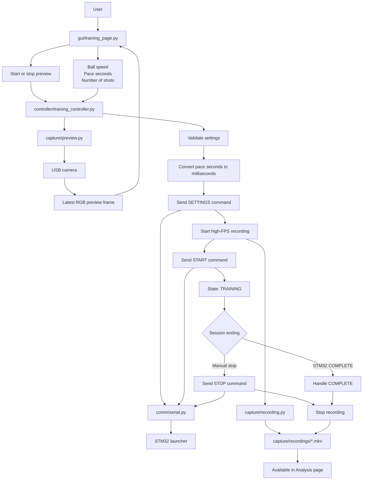
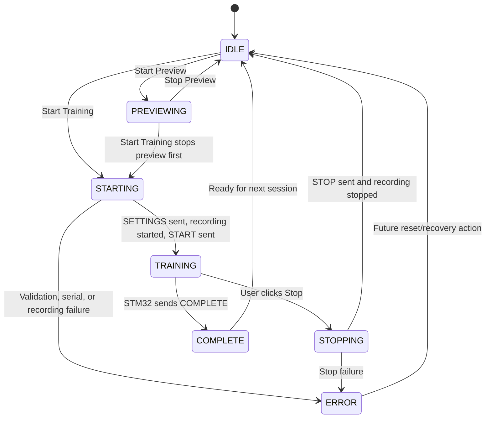

# Training Functionality

## Purpose

The Training workflow controls the live practice session.

It is responsible for:

```text
- Accepting launcher settings from the user
- Showing a low-FPS camera preview for setup
- Sending SETTINGS / START / STOP commands to the STM32 launcher
- Starting and stopping high-FPS camera recording
- Saving recordings for later offline analysis
- Handling future STM32 completion messages
```

The Training page is not a computer-vision page. Its job is to collect user input and display status while the controller coordinates hardware-facing modules.

---

## Main Files

| File | Responsibility |
| --- | --- |
| `gui/training_page.py` | Tkinter controls for speed, pace, shots, preview, start, stop, and test shot. |
| `controller/training_controller.py` | Training state machine, settings validation, preview/recording/serial coordination. |
| `controller/training_controller_config.py` | State names, setting limits, serial toggles, recording toggles, STM32 response keywords. |
| `capture/preview.py` | Low-FPS OpenCV camera preview service. |
| `capture/preview_config.py` | Preview camera index, preview resolution, FPS, debug settings. |
| `capture/recording.py` | GStreamer MJPG-to-MKV recorder. |
| `capture/recording_config.py` | Camera device, recording resolution, FPS, output naming, GStreamer queue settings. |
| `comm/serial.py` | STM32 protocol message builders and serial send helpers. |
| `comm/serial_config.py` | Serial device patterns, baud rate, command names, field validation limits. |

---

## Training Workflow



---

## Settings Validation

The GUI collects:

```text
ball_speed
pace_seconds
number_of_shots
```

The Training Controller validates those values using limits from `training_controller_config.py`.

Current defaults and limits:

| Setting | Meaning | Current Range |
| --- | --- | --- |
| Ball speed | Launcher speed value sent to STM32 | `0` to `100` |
| Pace seconds | Time between shots in the GUI | `0.1` to `60.0` seconds |
| Number of shots | Number of balls to launch | `1` to `999` |

The controller converts pace into milliseconds before sending it to the STM32:

```text
1.5 seconds -> 1500 milliseconds
```

---

## STM32 Protocol

`comm/serial.py` owns the serial protocol. The GUI and controller should not manually format serial strings.

Supported outgoing commands:

```text
SETTINGS:<ballspeed>:<rate_ms>:<number_of_shots>\n
START\n
STOP\n
```

Example session start:

```text
SETTINGS:75:1500:10
START
```

Manual stop:

```text
STOP
```

Important order:

```text
SETTINGS must be sent before START.
Recording should start before START so the beginning of the session is captured.
STOP is only sent for manual interruption.
```

---

## Preview Functionality

`capture/preview.py` provides `CameraPreviewService`.

The service:

```text
- Opens the camera with OpenCV
- Requests preview resolution, FPS, and MJPG format
- Reads frames in a background thread
- Stores only the latest RGB frame
- Lets the controller/GUI poll that latest frame
- Releases the camera when preview stops
```

Preview is intended for camera setup. It is deliberately separate from high-FPS recording.

```text
Preview path:
USB camera -> OpenCV VideoCapture -> latest RGB frame -> Tkinter display

Recording path:
USB camera -> GStreamer -> MKV file -> offline analysis
```

---

## Recording Functionality

`capture/recording.py` provides `MjpegRecorder`.

The recorder:

```text
- Verifies the configured camera device exists
- Builds a timestamped MKV output path
- Starts gst-launch-1.0 in a subprocess
- Records MJPG directly into a Matroska container
- Sends SIGINT to stop GStreamer cleanly
- Uses the -e flag so the MKV file is finalized
- Watches the process in a background thread
```

Current recording pipeline:

```text
v4l2src
  -> image/jpeg caps
  -> queue
  -> jpegparse
  -> matroskamux
  -> filesink
```

Output files are saved in:

```text
capture/recordings/
```

Those recordings become the input videos for the Analysis page.

---

## State Machine



---

## Manual Stop vs COMPLETE

Manual stop means the user interrupted the training session:

```text
User clicks Stop
Controller sends STOP to STM32
Controller stops recording
State returns to IDLE
```

`COMPLETE` means the STM32 finished normally:

```text
STM32 sends COMPLETE
Controller stops recording
Controller marks session complete
Controller does not send STOP back
```

`training_controller.py` already has `handle_stm32_message()` and `_handle_stm32_complete()` for this behavior. A persistent serial listener is still the missing integration piece.

---

## Current Status

Working or mostly connected:

```text
- Training page controls
- Settings validation
- Pace conversion to milliseconds
- Preview service integration
- Real GStreamer recording integration
- STM32 command building
- Optional real STM32 serial sending
- Manual stop flow
- COMPLETE message handler
```

Still improving:

```text
- Continuous STM32 response listener
- Automatic COMPLETE detection from live serial input
- Preview table-detection overlay
- Stronger GUI summaries after a recording finishes
- Automatic handoff from completed recording to analysis selection
```

---

## Design Rules

```text
training_page.py should display controls and status only.
training_controller.py should coordinate state and workflows.
capture/preview.py should own preview camera loops.
capture/recording.py should own GStreamer recording.
comm/serial.py should own STM32 protocol formatting and sending.
analysis/ modules should not be used inside the Training page.
```
